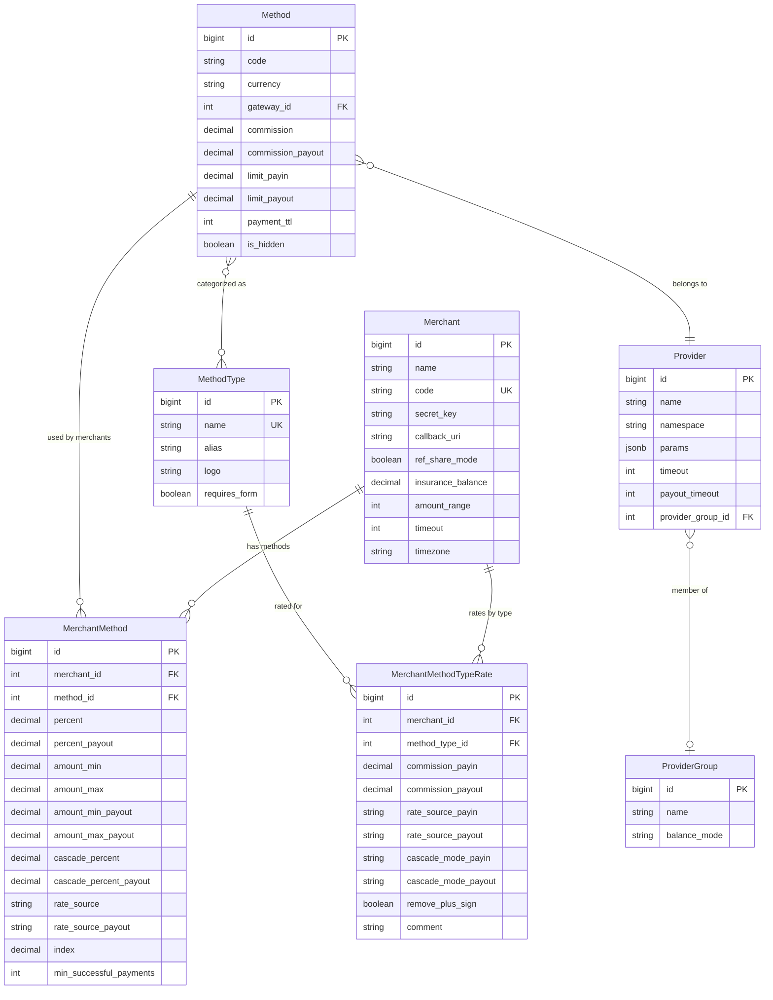
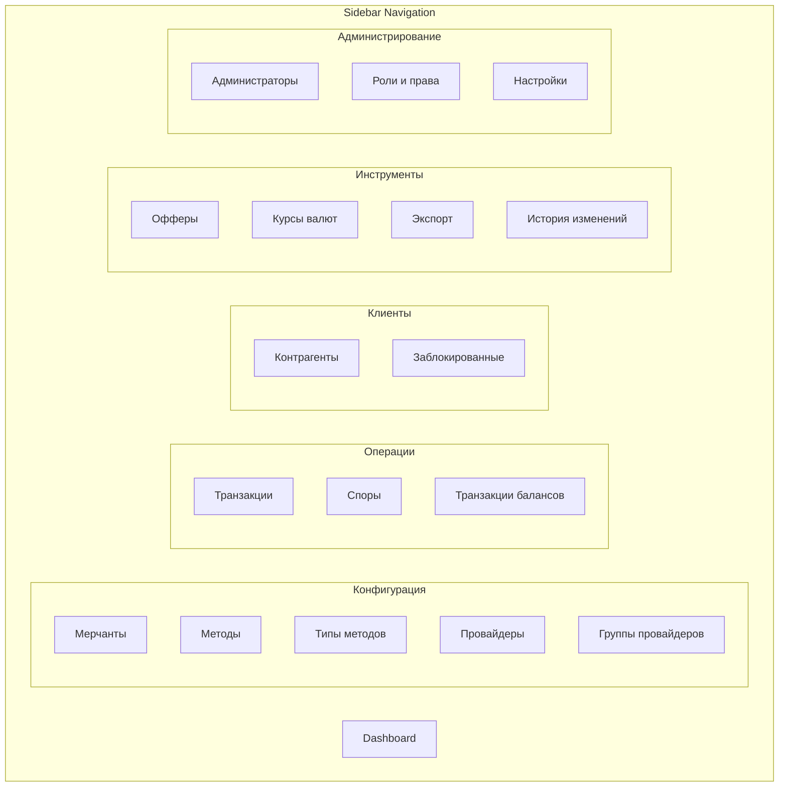

# ТЗ: Новая админ-панель платёжного агрегатора

> Документ для продукт-дизайнера. Описывает экраны, user flows, модели данных и UX-требования для прототипирования.

---

## Глоссарий

| Термин | Определение |
|--------|------------|
| **Мерчант** | Подключённая к агрегатору компания, принимающая/отправляющая платежи |
| **Метод** | Конкретный канал приёма/выплаты денег (например: "OnePAY_СБП_<1000") |
| **Провайдер (Gateway)** | Внешняя платёжная система, к которой подключены методы |
| **Тип метода** | Категория методов по способу оплаты (c2c, sbp, crypto, ecom, nspk...) |
| **Pivot (merchant_method)** | Связь мерчанта и метода с индивидуальными настройками (комиссии, лимиты, шансы каскада) |
| **MethodTypeRate** | Ставки мерчанта по типу метода (альтернатива индивидуальным ставкам per method) |
| **ref_share_mode** | Режим мерчанта: ON = ставки задаются per method, OFF = ставки берутся из MethodTypeRates |
| **Каскад** | Механизм распределения трафика между методами по шансам (%) или приоритету |
| **cascade_percent** | Доля метода в каскаде (%). Сумма по всем методам одного типа = 100% |
| **cascade_mode** | Режим каскада: "percent" (по шансам) или "order" (по приоритету) |
| **Актуализация** | Синхронизация ставок из MethodTypeRates в привязанные методы |

---

## Общие UX-принципы

### Навигация
- Фиксированный **sidebar** слева с группировкой разделов по категориям
- **Topbar**: breadcrumbs, глобальный поиск, переключение языка, профиль пользователя, уведомления
- Все сложные сущности открываются как **отдельные страницы с табами** (не модалки)
- Deep linking: каждый таб и состояние фильтров отражается в URL

### Таблицы
- Server-side пагинация, сортировка, фильтрация
- Фильтры в collapsible-панели над таблицей (не в заголовках колонок)
- Сохранение состояния фильтров в URL (shareble link)
- Выбор колонок для отображения (column picker)
- Bulk-операции: чекбоксы + toolbar с действиями, появляющийся при выделении

### Формы
- Inline-валидация
- Автосохранение не используется — явные кнопки "Сохранить"
- Toast-уведомления о результате операции
- Обязательное поле "Причина изменения" при сохранении ключевых настроек (для аудит-лога)

### Доступность
- Все интерактивные элементы доступны с клавиатуры
- Цветовые статусы дублируются текстом/иконкой

---

# Часть 1. Система ролей и прав

## 1.1. Обзор

Текущее состояние: 4 жёстко заданные роли (superAdmin > admin > supportPlus > support) без гранулярных permissions. Новая система должна позволять гибко создавать роли и назначать права на уровне действий.

### Модель данных

```
┌──────────────┐       ┌──────────────────┐       ┌──────────────┐
│     Role     │──M:N──│  RolePermission   │──M:1──│  Permission  │
├──────────────┤       └──────────────────┘       ├──────────────┤
│ id           │                                   │ id           │
│ name         │       ┌──────────────────┐       │ resource     │
│ display_name │       │  AdminRoleAssign  │       │ action       │
│ description  │──1:N──├──────────────────┤       │ display_name │
│ is_system    │       │ admin_id         │       └──────────────┘
│ created_at   │       │ role_id          │
└──────────────┘       └──────────────────┘

┌──────────────┐
│    Admin     │
├──────────────┤
│ id           │
│ username     │
│ email        │
│ mfa_enabled  │
│ is_active    │
│ roles[]      │
│ created_at   │
└──────────────┘
```

### Ресурсы и действия (Permission matrix)

| Ресурс (resource) | Возможные действия (actions) |
|-------------------|------------------------------|
| `merchants` | view, create, edit, delete, manage_balance, manage_methods, manage_users |
| `methods` | view, create, edit, delete, manage_merchants, manage_whitelist |
| `providers` | view, create, edit, delete, manage_limits, manage_messages |
| `provider_groups` | view, create, edit, delete, manage_limits |
| `method_types` | view, create, edit, delete, bulk_update |
| `transactions` | view, edit, export, manage_disputes, resend_callback, retry_payout, transfer_payout |
| `counterparties` | view, edit, block, rebind |
| `method_offers` | view, create, edit, delete, export |
| `settings` | view, edit |
| `admins` | view, create, edit, delete, assign_roles |
| `roles` | view, create, edit, delete |
| `blocked_users` | view, unblock |
| `audit_history` | view |
| `exchange_rates` | view |
| `exports` | view, download |

---

## 1.2. Экраны

### Экран 1.2.1: Список ролей

**URL:** `/roles`

**Цель:** Просмотр, создание и управление ролями.

**Layout:**

```
┌─────────────────────────────────────────────────────────────┐
│  Роли                                        [+ Создать]   │
├─────────────────────────────────────────────────────────────┤
│                                                             │
│  ┌─────────┬──────────────┬─────────┬────────┬───────────┐  │
│  │  Роль   │  Описание    │ Тип     │ Польз. │ Действия  │  │
│  ├─────────┼──────────────┼─────────┼────────┼───────────┤  │
│  │ Super   │ Полный       │ Систем. │   2    │ 👁 ✏️     │  │
│  │ Admin   │              │         │        │           │  │
│  ├─────────┼──────────────┼─────────┼────────┼───────────┤  │
│  │ Admin   │ Управление   │ Систем. │   5    │ 👁 ✏️     │  │
│  │         │ контентом    │         │        │           │  │
│  ├─────────┼──────────────┼─────────┼────────┼───────────┤  │
│  │ Support │ Поддержка    │ Кастом. │   8    │ 👁 ✏️ 🗑  │  │
│  │ Manager │ + транзакции │         │        │           │  │
│  └─────────┴──────────────┴─────────┴────────┴───────────┘  │
│                                                             │
│  Системные роли нельзя удалить — только редактировать       │
│  описание и состав прав.                                    │
└─────────────────────────────────────────────────────────────┘
```

**Элементы:**
- Таблица: название, описание, тип (системная/кастомная), кол-во пользователей, действия
- Системные роли (is_system=true): нельзя удалить, можно редактировать права
- Кнопка "Создать роль" → переход на экран создания
- Действия: просмотр, редактирование, удаление (только кастомных)

---

### Экран 1.2.2: Создание / Редактирование роли

**URL:** `/roles/create`, `/roles/{id}/edit`

**Цель:** Настройка прав роли через визуальную матрицу.

**Layout:**

```
┌──────────────────────────────────────────────────────────────────┐
│  ← Назад к списку           Создание роли                       │
├──────────────────────────────────────────────────────────────────┤
│                                                                  │
│  Название роли:  [_________________________]                     │
│  Описание:       [_________________________]                     │
│                                                                  │
│  ── Матрица прав ───────────────────────────────────────────     │
│                                                                  │
│  [Выбрать все] [Снять все]    Поиск: [___________]               │
│                                                                  │
│  ┌──────────────┬──────┬────────┬──────┬────────┬──────────┐     │
│  │  Ресурс      │ Все  │ Просм. │ Созд.│ Редакт.│ Удалить  │ ... │
│  ├──────────────┼──────┼────────┼──────┼────────┼──────────┤     │
│  │ ☐ Мерчанты  │  ☐   │   ☑    │  ☑   │   ☑    │    ☐     │     │
│  │   ├ Баланс   │      │        │      │   ☑    │          │     │
│  │   ├ Методы   │      │        │      │   ☑    │          │     │
│  │   └ Юзеры    │      │        │      │   ☐    │          │     │
│  ├──────────────┼──────┼────────┼──────┼────────┼──────────┤     │
│  │ ☐ Методы    │  ☐   │   ☑    │  ☐   │   ☐    │    ☐     │     │
│  │   ├ Мерчанты │      │        │      │   ☐    │          │     │
│  │   └ Whitelist│      │        │      │   ☐    │          │     │
│  ├──────────────┼──────┼────────┼──────┼────────┼──────────┤     │
│  │ ☐ Провайдеры│  ☐   │   ☑    │  ☐   │   ☐    │    ☐     │     │
│  ├──────────────┼──────┼────────┼──────┼────────┼──────────┤     │
│  │ ☐ Транзакции│  ☐   │   ☑    │  ☐   │   ☐    │    ☐     │     │
│  │   ├ Экспорт  │      │        │      │   ☑    │          │     │
│  │   ├ Диспуты  │      │        │      │   ☐    │          │     │
│  │   └ Callback │      │        │      │   ☐    │          │     │
│  ├──────────────┼──────┼────────┼──────┼────────┼──────────┤     │
│  │ ...          │      │        │      │        │          │     │
│  └──────────────┴──────┴────────┴──────┴────────┴──────────┘     │
│                                                                  │
│  ── Пользователи с этой ролью ──────────────────────────────     │
│  (при редактировании)                                            │
│  admin@test.com, john@test.com, ... (всего: 5)                   │
│                                                                  │
│                              [Отмена]  [Сохранить]               │
└──────────────────────────────────────────────────────────────────┘
```

**UX-требования к матрице прав:**

1. **Иерархия ресурсов**: основные ресурсы (Мерчанты, Методы...) раскрываются и содержат вложенные действия. При чекбоксе "Все" на строке — выделяются все действия по ресурсу.
2. **Колонка "Все"**: чекбокс в строке ресурса — включает все действия по данному ресурсу. Чекбокс в шапке колонки — включает все действия по всем ресурсам.
3. **Зависимости**: если включено "Редактировать" — автоматически включается "Просмотр" (нельзя снять). Если включено "Удалить" — автоматически включаются "Просмотр" и "Редактировать".
4. **Визуальная обратная связь**: при наведении на чекбокс — подсветка всей строки. При клике — мгновенное обновление (без задержки).
5. **Поиск**: фильтрация строк матрицы по названию ресурса.
6. **Быстрые действия**: "Выбрать все", "Снять все", "Только просмотр" (preset).

**Состояния:**
- Создание: пустая матрица
- Редактирование: предзаполненная матрица + список пользователей внизу
- Системная роль: название non-editable, предупреждение "Системная роль"

---

### Экран 1.2.3: Список администраторов

**URL:** `/admins`

**Цель:** Управление учётными записями администраторов.

**Layout:**

```
┌──────────────────────────────────────────────────────────────────┐
│  Администраторы                              [+ Создать]        │
├──────────────────────────────────────────────────────────────────┤
│                                                                  │
│  Фильтры: [Роль ▾]  [Статус ▾]  [Поиск по имени/email___]      │
│                                                                  │
│  ┌─────┬────────────┬──────────────┬────────┬─────┬──────────┐  │
│  │  ID │ Логин      │ Email        │ Роли   │ MFA │ Действия │  │
│  ├─────┼────────────┼──────────────┼────────┼─────┼──────────┤  │
│  │  1  │ admin      │ a@test.com   │ Super  │  ✓  │ ✏️ 🔑    │  │
│  │     │            │              │ Admin  │     │          │  │
│  ├─────┼────────────┼──────────────┼────────┼─────┼──────────┤  │
│  │  2  │ john       │ j@test.com   │ Admin  │  ✓  │ ✏️ 🔑 🗑 │  │
│  ├─────┼────────────┼──────────────┼────────┼─────┼──────────┤  │
│  │  3  │ support1   │ s@test.com   │ Sup.+  │  ✗  │ ✏️ 🔑 🗑 │  │
│  └─────┴────────────┴──────────────┴────────┴─────┴──────────┘  │
│                                                                  │
│  Действия: ✏️ Редактировать, 🔑 Сбросить 2FA, 🗑 Деактивировать│
└──────────────────────────────────────────────────────────────────┘
```

**Элементы:**
- Фильтры: роль (multi-select), статус (активен/деактивирован), поиск
- Таблица: ID, логин, email, роли (badges), MFA статус, действия
- Действия: редактировать, сбросить 2FA, деактивировать (soft delete)
- Нельзя деактивировать последнего пользователя с ролью "Super Admin"

---

### Экран 1.2.4: Создание / Редактирование администратора

**URL:** `/admins/create`, `/admins/{id}/edit`

**Цель:** Настройка учётной записи и назначение ролей.

**Layout:**

```
┌──────────────────────────────────────────────────────────────────┐
│  ← Назад          Редактирование администратора                  │
├──────────────────────────────────────────────────────────────────┤
│                                                                  │
│  ┌─ Основные данные ──────────────────────────────────────────┐  │
│  │                                                            │  │
│  │  Логин:    [admin_________]                                │  │
│  │  Email:    [admin@test.com]                                │  │
│  │  Пароль:   [••••••••••••••] [Сгенерировать]                │  │
│  │  Статус:   ● Активен  ○ Деактивирован                     │  │
│  │                                                            │  │
│  └────────────────────────────────────────────────────────────┘  │
│                                                                  │
│  ┌─ Роли ─────────────────────────────────────────────────────┐  │
│  │                                                            │  │
│  │  Назначенные:                                              │  │
│  │  ┌────────────┐  ┌────────────┐                            │  │
│  │  │ Admin    ✕ │  │ Support+ ✕ │                            │  │
│  │  └────────────┘  └────────────┘                            │  │
│  │                                                            │  │
│  │  Добавить роль: [Select role       ▾]                      │  │
│  │                                                            │  │
│  │  Итоговые права (read-only, рассчитываются из ролей):      │  │
│  │  ┌──────────────┬────┬────┬────┬────┬─────────────┐        │  │
│  │  │  Ресурс      │ 👁 │ ➕ │ ✏️ │ 🗑 │ Спец.       │        │  │
│  │  ├──────────────┼────┼────┼────┼────┼─────────────┤        │  │
│  │  │ Мерчанты     │ ✓  │ ✓  │ ✓  │ ✗  │ баланс,юзер │        │  │
│  │  │ Методы       │ ✓  │ ✓  │ ✓  │ ✗  │ мерчанты    │        │  │
│  │  │ Транзакции   │ ✓  │ ✗  │ ✓  │ ✗  │ экспорт     │        │  │
│  │  │ ...          │    │    │    │    │             │        │  │
│  │  └──────────────┴────┴────┴────┴────┴─────────────┘        │  │
│  │                                                            │  │
│  └────────────────────────────────────────────────────────────┘  │
│                                                                  │
│                               [Отмена]  [Сохранить]              │
└──────────────────────────────────────────────────────────────────┘
```

**UX-требования:**
- Роли назначаются как tags: выбрать из dropdown → появляется badge с крестиком
- При назначении нескольких ролей — права суммируются (union)
- "Итоговые права" — read-only матрица, показывающая результирующие права из всех назначенных ролей (union). Помогает понять, что конкретно может делать пользователь
- При создании: обязательные поля — логин, email, пароль. Роль может быть назначена позже
- При редактировании: пароль опционален (оставить пустым = не менять)

---

## 1.3. User Flow: управление доступом

```
Администратор (superAdmin)
    │
    ├─► Создаёт роль "Финансовый менеджер"
    │     └─ Права: merchants.view, merchants.manage_balance, 
    │        transactions.view, transactions.export
    │
    ├─► Создаёт роль "Оператор поддержки"  
    │     └─ Права: transactions.view, transactions.edit,
    │        transactions.manage_disputes, counterparties.view
    │
    ├─► Назначает роль "Финансовый менеджер" пользователю ivan@company.com
    │
    └─► ivan@company.com входит в админку:
          ├─ Sidebar: видит только "Мерчанты", "Транзакции", "Экспорт"
          ├─ Мерчанты: видит список, может пополнять баланс, НЕ может редактировать настройки
          └─ Транзакции: видит список, может экспортировать, НЕ может менять статус
```

## 1.4. Поведение при недостатке прав

| Ситуация | Поведение |
|----------|-----------|
| Нет права на раздел | Раздел не показывается в sidebar |
| Нет права на действие | Кнопка/ссылка не отображается или disabled с tooltip "Нет прав" |
| Нет права на редактирование | Страница открывается в read-only режиме: формы disabled, кнопки скрыты |
| Прямой переход по URL | Страница 403 с сообщением "Недостаточно прав" и кнопкой "На главную" |

---

# Часть 2. Настройка методов мерчанта

## 2.1. Обзор

Это самый важный и сложный экран админки. Здесь оператор привязывает методы к мерчанту, настраивает комиссии, лимиты и каскад. Текущее решение — одна страница в 2330 строк, где всё вперемешку. Новое решение разбивает его на логичные табы.

### Ключевая бизнес-логика

**Два режима ставок мерчанта (ref_share_mode):**

| ref_share_mode = ON (per method) | ref_share_mode = OFF (per type) |
|----------------------------------|--------------------------------|
| Комиссии, курсы задаются на каждом pivot merchant_method | Комиссии, курсы берутся из MethodTypeRates |
| Оператор редактирует ставки прямо в таблице методов | Оператор редактирует ставки в разделе "Типы методов" |
| Гибко, но трудоёмко при большом кол-ве методов | Эффективно: одна настройка типа = все методы этого типа |
| Колонки комиссий и курсов видны в таблице | Колонки комиссий и курсов скрыты, баннер "Ставки по типам" |

**Каскад:**
- Каждый метод имеет `cascade_percent` (payin) и `cascade_percent_payout` — доля трафика
- При `cascade_mode = "percent"`: трафик распределяется по % между методами одного типа
- При `cascade_mode = "order"`: трафик идёт по приоритету (поле `index`), `cascade_percent` скрывается
- Метод считается ВКЛЮЧЁННЫМ, если указан `cascade_percent` или `cascade_percent_payout`
- Метод считается ВЫКЛЮЧЕННЫМ, если оба поля пусты/null

---

## 2.2. Навигация карточки мерчанта

**URL:** `/merchants/{id}`

Карточка мерчанта — страница с табами. Переключение табов отражается в URL.

```
┌──────────────────────────────────────────────────────────────────┐
│  ← Мерчанты    Merchant Name (CODE-123)     [История изменений] │
├──────────────────────────────────────────────────────────────────┤
│                                                                  │
│  ┌──────────┬──────────────┬─────────┬─────────┬──────┬────────┐│
│  │ Основные │ Типы методов │ Методы  │ Баланс  │Юзеры │История ││
│  └──────────┴──────────────┴─────────┴─────────┴──────┴────────┘│
│                                                                  │
│  (содержимое активного таба)                                     │
│                                                                  │
└──────────────────────────────────────────────────────────────────┘
```

**Табы:**
1. **Основные** — общие настройки мерчанта
2. **Типы методов** — MethodTypeRates (ставки по типам)
3. **Методы** — привязанные методы с настройками pivot
4. **Баланс** — текущий баланс, пополнение, история
5. **Пользователи** — пользователи мерчанта
6. **История** — аудит-лог

На каждом табе — badge-счётчик:
- "Типы методов" — количество настроенных типов
- "Методы" — количество включённых / всего привязанных
- "Пользователи" — количество

---

## 2.3. Таб "Основные"

**URL:** `/merchants/{id}?tab=general`

**Поля формы:**

| Поле | Тип | Обязательное | Описание |
|------|-----|-------------|----------|
| name | text | да | Название мерчанта |
| code | text (readonly) | — | Код мерчанта (генерируется при создании) |
| secret_key | text (masked) | — | Секретный ключ, кнопка "Показать", "Копировать", "Перегенерировать" |
| callback_uri | url | нет | URL для callback-уведомлений |
| success_uri | url | нет | URL редиректа при успехе |
| fail_uri | url | нет | URL редиректа при ошибке |
| flow_url | url | нет | URL платёжной формы |
| logo_url | url | нет | URL логотипа |
| verticals | multi-select (tags) | нет | Вертикали (направления бизнеса) |
| whitelistIps | multi-select (tags) | нет | IP-адреса в whitelist |
| timezone | select | нет | Часовой пояс |
| timeout | number | нет | Таймаут запросов (сек) |
| payout_expired_time | number | нет | Таймаут выплаты (мин) |
| amount_range | number | нет | Сумма разброса |
| netting | number | нет | Неттинг |
| agent_comission_payin | number | нет | Агентская комиссия payin (%) |
| agent_comission_payout | number | нет | Агентская комиссия payout (%) |
| telegram_token_id | select | нет | Telegram-токен для уведомлений |
| ref_share_mode | switch | — | Режим ставок: по методам / по типам |
| send_cancel_payout_callback | switch | — | Отправлять callback при отмене выплаты |
| reverse_namespace | select | нет | Обратный gateway (для реверсов) |
| reverse_params | key-value editor | нет | Параметры обратного gateway |

**Layout формы:**

```
┌──────────────────────────────────────────────────────────────────┐
│  ┌─ Идентификация ────────────────────────────────────────────┐  │
│  │  Название: [______]    Код: CODE-123 [📋]                 │  │
│  │  Ключ: ••••••••••••  [👁] [📋] [🔄]                      │  │
│  └────────────────────────────────────────────────────────────┘  │
│                                                                  │
│  ┌─ URL-ы ────────────────────────────────────────────────────┐  │
│  │  Callback: [https://...]    Success: [https://...]         │  │
│  │  Fail:     [https://...]    Flow:    [https://...]         │  │
│  │  Логотип:  [https://...]                                   │  │
│  └────────────────────────────────────────────────────────────┘  │
│                                                                  │
│  ┌─ Конфигурация ─────────────────────────────────────────────┐  │
│  │  Вертикали: [tag1] [tag2] [+ добавить]                     │  │
│  │  Whitelist IP: [ip1] [ip2] [+ добавить]                    │  │
│  │  Часовой пояс: [Europe/Moscow ▾]                           │  │
│  │  Таймаут: [30] сек     Таймаут выплаты: [60] мин          │  │
│  │  Разброс суммы: [0]   Неттинг: [0]                        │  │
│  └────────────────────────────────────────────────────────────┘  │
│                                                                  │
│  ┌─ Комиссии и режим ────────────────────────────────────────┐   │
│  │  Агентская payin: [0]%    Агентская payout: [0]%          │   │
│  │                                                            │   │
│  │  Режим ставок: [═══●] По методам (ref_share)               │   │
│  │  ⓘ При выключении ставки берутся из настроек типов методов │   │
│  │                                                            │   │
│  │  Callback при отмене выплаты: [●═══] Вкл                   │   │
│  └────────────────────────────────────────────────────────────┘   │
│                                                                  │
│  ┌─ Обратный gateway ────────────────────────────────────────┐   │
│  │  Namespace: [Select gateway  ▾]                            │   │
│  │  Параметры: (динамические key-value поля)                  │   │
│  └────────────────────────────────────────────────────────────┘   │
│                                                                  │
│  Причина изменения: [_______________________________________]    │
│                                                                  │
│                               [Отмена]  [Сохранить]              │
└──────────────────────────────────────────────────────────────────┘
```

**Группировка полей:** логические блоки с заголовками (Card-компоненты или collapsible sections). Двухколоночная раскладка для коротких полей.

---

## 2.4. Таб "Типы методов" (MethodTypeRates)

**URL:** `/merchants/{id}?tab=method-types`

**Цель:** Настройка ставок по типам методов. Особенно важен при ref_share_mode = OFF.

### Layout

```
┌──────────────────────────────────────────────────────────────────┐
│                                                                  │
│  ⓘ При ref_share_mode = OFF ставки из этого раздела              │
│    применяются ко всем методам данного типа.                     │
│    При ref_share_mode = ON используются как значения              │
│    по умолчанию при привязке нового метода.                      │
│                                                                  │
│  ┌──────────────────────────────────────────────────────────┐    │
│  │  Типы методов:                                           │    │
│  │  ┌─────┐ ┌─────┐ ┌─────┐ ┌─────┐ ┌─────┐ ┌─────┐       │    │
│  │  │ SBP │ │ C2C │ │NSPK │ │Crypto│ │ EСom│ │ P2P │ ...  │    │
│  │  │  ✓  │ │  ✓  │ │     │ │  ✓  │ │     │ │     │       │    │
│  │  └──●──┘ └──●──┘ └─────┘ └──●──┘ └─────┘ └─────┘       │    │
│  │  ● = настроен (зелёный)   ○ = не настроен (серый)        │    │
│  └──────────────────────────────────────────────────────────┘    │
│                                                                  │
│  ── Настройки выбранных типов ───────────────────────────────    │
│                                                                  │
│  ┌──────────┬──────────┬──────────┬──────────┬──────────┬────┐   │
│  │Тип метода│Payin %   │Каскад PI │Курс PI   │Payout %  │... │   │
│  ├──────────┼──────────┼──────────┼──────────┼──────────┼────┤   │
│  │ SBP      │ [2.5___] │[Шансы ▾] │[Binance▾]│ [3.0___] │    │   │
│  ├──────────┼──────────┼──────────┼──────────┼──────────┼────┤   │
│  │ C2C      │ [3.0___] │[Порядок▾]│[Bybit  ▾]│ [3.5___] │    │   │
│  ├──────────┼──────────┼──────────┼──────────┼──────────┼────┤   │
│  │ Crypto   │ [1.0___] │[Шансы ▾] │[Binance▾]│ [1.5___] │    │   │
│  └──────────┴──────────┴──────────┴──────────┴──────────┴────┘   │
│                                                                  │
│  Полные колонки таблицы:                                         │
│  Тип | Payin % | Каскад PI | Курс PI | Payout % | Каскад PO |   │
│       Курс PO | Убрать +  | Комментарий                         │
│                                                                  │
│  [Актуализировать SBP] [Актуализировать C2C] [Актуализировать все]│
│                                                                  │
│  Причина изменения: [_______________________________________]    │
│                               [Отмена]  [Сохранить все ставки]   │
└──────────────────────────────────────────────────────────────────┘
```

**Поля таблицы MethodTypeRate:**

| Поле | Тип | Описание |
|------|-----|----------|
| commission_payin | number (%) | Комиссия payin |
| cascade_mode_payin | select: "percent" / "order" | Режим каскада payin |
| rate_source_payin | select | Источник курса payin (Binance, Bybit, и др.) |
| commission_payout | number (%) | Комиссия payout |
| cascade_mode_payout | select: "percent" / "order" | Режим каскада payout |
| rate_source_payout | select | Источник курса payout |
| remove_plus_sign | checkbox | Убрать знак "+" из суммы |
| comment | text | Комментарий |

**UX-требования:**

1. **Badges типов**: показывают все доступные типы методов. Настроенные — зелёные с галочкой, ненастроенные — серые. Клик по badge добавляет/убирает тип из таблицы.
2. **Inline-редактирование**: все ячейки таблицы — editable. Числа — input number, режим каскада и курс — dropdown прямо в ячейке.
3. **Кнопки "Актуализировать"**: для каждого типа и "Актуализировать все". Показывает confirmation dialog с описанием: "Ставки из типа SBP будут применены ко всем привязанным методам этого типа. Продолжить?"
4. **После актуализации**: toast с результатом: "Обновлено: 12 методов, пропущено: 3 (нет привязки)"

---

## 2.5. Таб "Методы" (главный рабочий экран)

**URL:** `/merchants/{id}?tab=methods`

**Цель:** Управление привязанными методами, их ставками, лимитами и каскадом. Это основной экран для ежедневной работы оператора.

### Общий Layout

```
┌──────────────────────────────────────────────────────────────────┐
│                                                                  │
│  ┌─ Фильтры и действия ──────────────────────────────────────┐  │
│  │                                                            │  │
│  │  Тип:  [SBP] [C2C] [Crypto] [Все]     Статус: [Вкл ▾]    │  │
│  │  Валюта: [Все ▾]   Провайдер: [Все ▾]  Поиск: [________]  │  │
│  │                                                            │  │
│  │  Показывать: ● Включённые  ○ Все  ○ Выключенные            │  │
│  │                                                            │  │
│  └────────────────────────────────────────────────────────────┘  │
│                                                                  │
│  ┌─ Toolbar (появляется при выделении) ───────────────────────┐  │
│  │  Выбрано: 5 из 24                                          │  │
│  │  [Включить] [Выключить ▾] [Изменить настройки] [Снять все] │  │
│  └────────────────────────────────────────────────────────────┘  │
│                                                                  │
│  ┌─ Таблица методов ──────────────────────────────────────────┐  │
│  │  (см. детализацию ниже)                                    │  │
│  └────────────────────────────────────────────────────────────┘  │
│                                                                  │
│  [Привязать методы]                  [Сохранить все изменения]   │
│                                                                  │
└──────────────────────────────────────────────────────────────────┘
```

### Таблица методов (детализация)

Таблица — главный рабочий инструмент. Должна быть максимально компактной и эффективной для редактирования.

**Колонки:**

| # | Колонка | Тип | Editable | Видимость |
|---|---------|-----|----------|-----------|
| 0 | ☐ (checkbox) | checkbox | — | всегда |
| 1 | Статус | indicator (dot) | — | всегда |
| 2 | Метод | text + link | нет | всегда |
| 3 | Тип | badge | нет | всегда |
| 4 | Провайдер | text | нет | всегда |
| 5 | Валюта | text | нет | всегда |
| 6 | Payin % | number input | да | ref_share_mode = ON |
| 7 | Payout % | number input | да | ref_share_mode = ON |
| 8 | Мин. payin | number input | да | всегда |
| 9 | Макс. payin | number input | да | всегда |
| 10 | Мин. payout | number input | да | всегда |
| 11 | Макс. payout | number input | да | всегда |
| 12 | Шанс PI % | number input / slider | да | cascade_mode = "percent" |
| 13 | Шанс PO % | number input / slider | да | cascade_mode = "percent" |
| 14 | Порядок | number input | да | cascade_mode = "order" |
| 15 | Курс PI | select | да | ref_share_mode = ON |
| 16 | Курс PO | select | да | ref_share_mode = ON |
| 17 | Мин. оплат | number input | да | всегда |
| 18 | Действия | buttons | — | всегда |

**Статус-индикатор (колонка 1):**
- Зелёная точка = включён (есть cascade_percent или cascade_percent_payout)
- Серая точка = выключен
- Красная точка = удалён (soft delete)

**Действия (колонка 18):**
- Включить/Выключить (toggle)
- Перейти к методу (ссылка)
- Удалить привязку (с подтверждением)

### Inline-редактирование

**Требования:**
1. Ячейки с editable-полями выглядят как обычный текст, при клике/фокусе превращаются в input
2. Изменённые ячейки подсвечиваются (жёлтый фон или border)
3. При нажатии Tab — переход к следующей editable-ячейке в строке
4. При нажатии Enter — переход к следующей строке (та же колонка)
5. Кнопка "Сохранить все изменения" — отправляет ВСЕ изменённые строки одним batch-запросом
6. При уходе со страницы с несохранёнными изменениями — предупреждение "Есть несохранённые изменения"

### Визуальное поведение cascade_percent

```
┌──────────────────────────────────────────────────────────────────┐
│  Метод             │ Шанс PI │                                   │
│────────────────────┼─────────┤                                   │
│  OnePAY_SBP_<1000  │ [40 ]%  │  ████████░░░░░░░░░░░░ 40%        │
│  TwoPAY_SBP_<1000  │ [35 ]%  │  ███████░░░░░░░░░░░░░ 35%        │
│  ThreePAY_SBP      │ [25 ]%  │  █████░░░░░░░░░░░░░░░ 25%        │
│────────────────────┴─────────┤                                   │
│  Итого по типу SBP: 100%     │  ✓ (зелёный)                     │
│  Свободно: 0%                │                                   │
└──────────────────────────────────────────────────────────────────┘
```

- Визуальная полоска (mini progress bar) рядом с числом для наглядности
- Итого по типу внизу группы: если сумма != 100% — предупреждение (оранжевый)
- При вводе значения в одном методе — пересчёт "Свободно" в реальном времени

### Toolbar массовых операций

Появляется при выделении хотя бы одной строки:

```
┌──────────────────────────────────────────────────────────────────┐
│  ☑ Выбрано: 5 из 24  [Выбрать все]  [Снять]                     │
│                                                                  │
│  [● Включить]  [○ Выключить ▾]  [✏ Изменить настройки]          │
└──────────────────────────────────────────────────────────────────┘
```

**Кнопка "Выключить" — dropdown:**
- Выключить payin
- Выключить payout
- Выключить всё (payin + payout)

**Кнопка "Изменить настройки" → Sheet/Drawer справа:**

### Sheet "Массовое изменение" (Bulk Edit)

```
┌──────────────────────────────────────────┐
│  Массовое изменение (5 методов)       ✕  │
├──────────────────────────────────────────┤
│                                          │
│  Изменяются только заполненные поля.     │
│  Пустые поля не затрагиваются.           │
│                                          │
│  ── Payin ─────────────────────────────  │
│  Комиссия %:     [________]              │
│  Мин. сумма:     [________]              │
│  Макс. сумма:    [________]              │
│  Шанс каскада %: [________]              │
│  Источник курса: [Select ▾]              │
│                                          │
│  ── Payout ────────────────────────────  │
│  Комиссия %:     [________]              │
│  Мин. сумма:     [________]              │
│  Макс. сумма:    [________]              │
│  Шанс каскада %: [________]              │
│  Источник курса: [Select ▾]              │
│                                          │
│  ── Общее ─────────────────────────────  │
│  Мин. успешных платежей: [________]      │
│                                          │
│  ── Статус ────────────────────────────  │
│  ● Не менять                             │
│  ○ Включить выбранные                    │
│  ○ Выключить выбранные                   │
│                                          │
│  Видимость: ref_share_mode = OFF →       │
│  комиссии и курсы скрыты                 │
│                                          │
│  Причина: [_________________________]    │
│                                          │
│           [Отмена]   [Применить]         │
└──────────────────────────────────────────┘
```

**UX-требования к Sheet:**
1. Открывается как Drawer/Sheet справа (не блокирующая модалка, чтобы видеть таблицу)
2. Отображает количество выбранных методов в заголовке
3. При ref_share_mode = OFF: блоки "Комиссия %" и "Источник курса" скрыты (или disabled с tooltip)
4. Пустые поля не меняют существующие значения
5. После применения: toast с результатом + таблица обновляется

### Dialog "Привязать методы"

```
┌──────────────────────────────────────────────────────────────────┐
│  Привязать методы к мерчанту                                  ✕  │
├──────────────────────────────────────────────────────────────────┤
│                                                                  │
│  Поиск: [_____________]  Тип: [Все ▾]  Валюта: [Все ▾]          │
│                                                                  │
│  ┌─────┬───────────────────┬────────┬─────────┬────────────┐     │
│  │  ☐  │ Метод             │ Тип    │ Валюта  │ Провайдер  │     │
│  ├─────┼───────────────────┼────────┼─────────┼────────────┤     │
│  │  ☑  │ NewPAY_SBP_<500   │ SBP    │ RUB     │ NewPAY     │     │
│  │  ☑  │ NewPAY_SBP_>500   │ SBP    │ RUB     │ NewPAY     │     │
│  │  ☐  │ AnotherPAY_C2C    │ C2C    │ RUB     │ AnotherPAY │     │
│  │  ☐  │ CryptoPAY_USDT    │ Crypto │ USDT    │ CryptoPAY  │     │
│  └─────┴───────────────────┴────────┴─────────┴────────────┘     │
│                                                                  │
│  Показаны только методы, ещё не привязанные к мерчанту.          │
│  Выбрано: 2                                                      │
│                                                                  │
│                    [Отмена]   [Привязать выбранные]               │
└──────────────────────────────────────────────────────────────────┘
```

**UX-требования:**
- Показываются только непривязанные к данному мерчанту методы
- Multi-select с поиском и фильтрами
- После привязки: методы появляются в таблице в состоянии "Выключен" (cascade_percent не задан)
- Toast: "Привязано 2 метода"

---

## 2.6. Таб "Баланс"

**URL:** `/merchants/{id}?tab=balance`

```
┌──────────────────────────────────────────────────────────────────┐
│                                                                  │
│  ┌─ Текущий баланс ──────────────────────────────────────────┐   │
│  │                                                            │   │
│  │  ┌──────────┐  ┌──────────────┐  ┌────────────────────┐   │   │
│  │  │  12 500  │  │  Insurance   │  │  Netting: 0        │   │   │
│  │  │   USDT   │  │    500 USDT  │  │                    │   │   │
│  │  └──────────┘  └──────────────┘  └────────────────────┘   │   │
│  │                                                            │   │
│  └────────────────────────────────────────────────────────────┘   │
│                                                                  │
│  ┌─ Пополнение баланса ──────────────────────────────────────┐   │
│  │  Сумма:  [________] USDT                                  │   │
│  │  Хеш транзакции: [________________________________]       │   │
│  │  Причина: [________________________________]              │   │
│  │                                  [Пополнить]              │   │
│  └────────────────────────────────────────────────────────────┘   │
│                                                                  │
│  ┌─ История операций ────────────────────────────────────────┐   │
│  │  (таблица с пагинацией: дата, тип, сумма, хеш, оператор) │   │
│  └────────────────────────────────────────────────────────────┘   │
│                                                                  │
└──────────────────────────────────────────────────────────────────┘
```

---

## 2.7. Таб "Пользователи"

**URL:** `/merchants/{id}?tab=users`

```
┌──────────────────────────────────────────────────────────────────┐
│                                                                  │
│  ┌──────┬──────────┬──────────────┬──────┬─────────────────────┐ │
│  │  ID  │ Логин    │ Email        │ MFA  │ Действия            │ │
│  ├──────┼──────────┼──────────────┼──────┼─────────────────────┤ │
│  │  1   │ user1    │ u1@merch.com │  ✓   │ [Сброс пароля]      │ │
│  │      │          │              │      │ [Сброс 2FA]         │ │
│  ├──────┼──────────┼──────────────┼──────┼─────────────────────┤ │
│  │  2   │ user2    │ u2@merch.com │  ✗   │ [Сброс пароля]      │ │
│  └──────┴──────────┴──────────────┴──────┴─────────────────────┘ │
│                                                                  │
│  Действия подтверждаются confirmation dialog.                    │
│  После сброса — toast с новым паролем (копировать).              │
│                                                                  │
└──────────────────────────────────────────────────────────────────┘
```

---

## 2.8. User Flow: быстрая настройка нового мерчанта

```
Оператор создаёт мерчанта
    │
    ├─ 1. Заполняет основные данные (таб "Основные")
    │     name, callback_uri, verticals, timezone
    │     Выбирает ref_share_mode
    │     → [Сохранить]
    │
    ├─ 2. Настраивает ставки по типам (таб "Типы методов")
    │     Выбирает нужные типы (SBP, C2C, Crypto)
    │     Заполняет комиссии, каскад, курсы
    │     → [Сохранить все ставки]
    │     → [Актуализировать все] (опционально, если методы уже привязаны)
    │
    ├─ 3. Привязывает методы (таб "Методы")
    │     → [Привязать методы] → Dialog
    │     Выбирает все нужные методы (фильтр по типу)
    │     → [Привязать выбранные]
    │
    ├─ 4. Массовая настройка методов
    │     ☑ Выделяет все SBP-методы (фильтр по типу)
    │     → [Изменить настройки] → Sheet
    │     Задаёт лимиты, шансы, статус = "Включить"
    │     → [Применить]
    │
    │     Повторяет для C2C, Crypto...
    │
    ├─ 5. Точечная настройка (если нужно)
    │     Inline-редактирование отдельных ячеек
    │     → [Сохранить все изменения]
    │
    └─ Мерчант готов к работе ✓
```

**Время настройки мерчанта:**
- Текущее решение: ~15-30 минут (навигация между страницами, ожидание загрузки, отдельные формы)
- Целевое: ~3-5 минут (табы на одной странице, bulk-операции, inline-редактирование)

---

## 2.9. User Flow: массовое изменение ставок

```
Бизнес решает поднять комиссию для всех SBP-методов у мерчанта
    │
    ├─ Вариант A (ref_share_mode = OFF):
    │   1. Таб "Типы методов"
    │   2. Изменить commission_payin у SBP
    │   3. [Сохранить]
    │   4. [Актуализировать SBP] → ставки применятся ко всем методам
    │   Итого: 3 клика
    │
    └─ Вариант B (ref_share_mode = ON):
        1. Таб "Методы"
        2. Фильтр по типу "SBP"
        3. [Выбрать все]
        4. [Изменить настройки] → Sheet
        5. Ввести новую комиссию payin %
        6. [Применить]
        Итого: 5 кликов
```

---

## 2.10. Список мерчантов

**URL:** `/merchants`

```
┌──────────────────────────────────────────────────────────────────┐
│  Мерчанты                                    [+ Создать]        │
├──────────────────────────────────────────────────────────────────┤
│                                                                  │
│  ┌─ Фильтры ─────────────────────────────────────────────────┐  │
│  │  Поиск: [__________]  Вертикаль: [Все ▾]  Статус: [Все ▾] │  │
│  │  Показывать удалённые: [ ]                                 │  │
│  └────────────────────────────────────────────────────────────┘  │
│                                                                  │
│  ┌─────┬────────────┬──────┬──────────┬─────────┬───────────┐   │
│  │  ID │ Название   │ Код  │ Баланс   │ Методов │ Действия  │   │
│  ├─────┼────────────┼──────┼──────────┼─────────┼───────────┤   │
│  │  1  │ Merchant A │ MA01 │ 12500 U  │ 15 / 24 │ ✏️ 📋 🗑  │   │
│  │  2  │ Merchant B │ MB02 │  3200 U  │  8 / 12 │ ✏️ 📋 🗑  │   │
│  │  3  │ Merchant C │ MC03 │   800 U  │  3 /  5 │ ✏️ 📋 🗑  │   │
│  └─────┴────────────┴──────┴──────────┴─────────┴───────────┘   │
│                                                                  │
│  "Методов" = включённых / всего привязанных                     │
│  📋 = копировать код мерчанта                                    │
│                                                                  │
│  Пагинация: ← 1 2 3 ... 10 →                                   │
└──────────────────────────────────────────────────────────────────┘
```

---

## 2.11. Компоненты UI (рекомендации для дизайнера)

Основываясь на UI-ките из Supernova (shadcn/ui), рекомендуемые компоненты:

| Задача | Компонент | Файл из Supernova |
|--------|-----------|-------------------|
| Табы карточки | Tabs | `src/components/ui/tabs.tsx` |
| Таблица методов | Table + inline inputs | `src/components/ui/table.tsx` |
| Фильтры | Select, Input, Button Group | `src/components/ui/select.tsx` |
| Bulk-toolbar | Floating bar / Sticky header | — (кастомный) |
| Bulk-sheet | Sheet (drawer) | `src/components/ui/sheet.tsx` |
| Привязка методов | Dialog + Table | `src/components/ui/dialog.tsx` |
| Badges типов | Badge | `src/components/ui/badge.tsx` |
| Уведомления | Sonner (toast) | `src/components/ui/sonner.tsx` |
| Switch ref_share_mode | Switch | `src/components/ui/switch.tsx` |
| Tag-inputs (IP, вертикали) | Input + Badge | — (кастомный) |
| Confirmation | AlertDialog | `src/components/ui/alert-dialog.tsx` |
| Breadcrumbs | Breadcrumb | `src/components/ui/breadcrumb.tsx` |
| Permission matrix | Checkbox + Table | `src/components/ui/checkbox.tsx` + `table.tsx` |
| Sidebar навигация | Sidebar | `src/components/ui/sidebar.tsx` |
| Формы | Form + Field | `src/components/ui/form.tsx`, `field.tsx` |
| Editable cells | Input (conditional render) | `src/components/ui/input.tsx` |
| Cascade progress | Progress | `src/components/ui/progress.tsx` |
| Dropdown действий | DropdownMenu | `src/components/ui/dropdown-menu.tsx` |

---

## Приложение A. ER-диаграмма основных сущностей



---

## Приложение B. Навигация sidebar



Видимость каждого раздела определяется системой прав (Часть 1).
