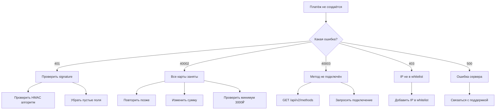

# 🔧 Troubleshooting Guide

> Руководство по решению типичных проблем

---

## 1. Ошибки API

### 1.1 Error 401 Unauthorized

**Симптомы:**
```json
{
    "status": false,
    "error": {
        "code": 401,
        "message": "Unauthorized"
    }
}
```

**Возможные причины:**

| Причина | Диагностика | Решение |
|---------|-------------|---------|
| Неверный token | Проверить Authorization header | Использовать актуальный Bearer token |
| Неверная signature | Проверить алгоритм HMAC | См. примеры ниже |
| Token истёк | Проверить дату выдачи | Запросить новый token |
| Пустые URI поля | Проверить body | Убрать пустые successUri, failUri, callbackUri |

**Чек-лист проверки Signature:**

```python
# ❌ НЕПРАВИЛЬНО - пробелы в JSON
json.dumps(data)  # {"orderId": "123", "amount": 1000}

# ✅ ПРАВИЛЬНО - без пробелов
json.dumps(data, separators=(',', ':'))  # {"orderId":"123","amount":1000}
```

```javascript
// ❌ НЕПРАВИЛЬНО - объект
const sig = hmac(data, secretKey);

// ✅ ПРАВИЛЬНО - строка JSON
const sig = hmac(JSON.stringify(data), secretKey);
```

```php
// ❌ НЕПРАВИЛЬНО - base64
$sig = base64_encode(hash_hmac('sha256', $body, $key, true));

// ✅ ПРАВИЛЬНО - hex
$sig = hash_hmac('sha256', $body, $key);
```

---

### 1.2 Error 40002 - All requisites are busy

**Симптомы:**
```json
{
    "status": false,
    "error": {
        "code": 40002,
        "message": "Invoice creation failed",
        "details": "All requisites are busy or url is not available"
    }
}
```

**Возможные причины:**

| Причина | Вероятность | Решение |
|---------|-------------|---------|
| Все карты заняты | 60% | Повторить через 1-2 минуты |
| Сумма слишком маленькая | 20% | Увеличить до минимум 3000₽ |
| Дублирующийся userId+amount | 10% | Изменить userId или amount |
| Провайдер недоступен | 5% | Каскад переключится автоматически |
| Нет активных трейдеров | 5% | Связаться с поддержкой |

**Рекомендуемый retry:**
```javascript
async function createPaymentWithRetry(data, maxRetries = 3) {
    for (let i = 0; i < maxRetries; i++) {
        const response = await createPayment(data);
        
        if (response.status === true) {
            return response;
        }
        
        if (response.error?.code === 40002) {
            // Изменяем сумму для уникальности
            data.amount = data.amount + i + 1;
            await sleep(2000); // Ждём 2 секунды
            continue;
        }
        
        throw new Error(response.error?.message);
    }
    throw new Error('All retries failed');
}
```

---

### 1.3 Error 40003 - Invalid payment method

**Симптомы:**
```json
{
    "status": false,
    "error": {
        "code": 40003,
        "message": "Invalid payment method"
    }
}
```

**Причины:**
1. Метод не подключён для мерчанта
2. Опечатка в названии метода
3. Несоответствие валюты и метода

**Диагностика:**
```bash
# Проверить доступные методы
curl -X GET "https://api.domain.com/api/v2/methods" \
  -H "Authorization: Bearer {token}"
```

**Решение:**
- Запросить подключение метода у поддержки
- Проверить правильность написания code метода
- Убедиться, что currency соответствует методу

---

### 1.4 Error 40004 - Insufficient funds

**Симптомы:**
```json
{
    "status": false,
    "error": {
        "code": 40004,
        "message": "Insufficient funds"
    }
}
```

**Для Payout:**
- Недостаточно средств на балансе мерчанта
- Проверить баланс: `GET /api/v2/balance`
- Пополнить баланс или уменьшить сумму payout

---

### 1.5 Error 403 - Access denied

**Симптомы:**
```json
{
    "status": false,
    "error": {
        "code": 403,
        "message": "Access denied"
    }
}
```

**Причина:** IP не в whitelist

**Решение:**
1. Узнать текущий IP
2. Добавить IP в whitelist через админку или поддержку
3. Для динамических IP — использовать VPN с фиксированным IP

---

## 2. Проблемы с платежами

### 2.1 Платёж не создаётся

**Диагностика:**



### 2.2 Callback не приходит

**Чек-лист:**

- [ ] callbackUri доступен из интернета
- [ ] callbackUri возвращает HTTP 200
- [ ] IP 116.202.228.230 и 64.226.73.77 в whitelist
- [ ] SSL сертификат валидный
- [ ] Нет редиректов (301/302)
- [ ] Content-Type: application/json в ответе

**Тестирование callbackUri:**
```bash
curl -X POST "https://your-domain.com/callback" \
  -H "Content-Type: application/json" \
  -H "Signature: test" \
  -d '{"test": true}'
```

### 2.3 Платёж завис в pending

**Возможные причины:**

| Причина | Признаки | Действия |
|---------|----------|----------|
| Плательщик не оплатил | Нет SMS у трейдера | Ждать или отменить |
| SMS не распарсился | SMS в логах, заявка открыта | Ручное подтверждение |
| Callback не прошёл | Платёж finished, callback не получен | Проверить callbackUri |
| Трейдер offline | Telegram уведомление не доставлено | Эскалация |

**Ручная проверка статуса:**
```bash
curl -X GET "https://api.domain.com/api/v2/orders/{orderId}/status" \
  -H "Authorization: Bearer {token}"
```

### 2.4 Сумма отличается от запрошенной

**Причина:** Уникализация сумм (amount_range)

**Объяснение:**
- Если мерчант имеет `amount_range > 0`
- Система добавляет случайное число [1, amount_range]
- Пример: запрос 5000₽ → выдано 5003₽

**Поля ответа:**
- `init_amount` — изначальная сумма (5000)
- `amount` — итоговая сумма (5003)

**Рекомендация:** Использовать `amount` из ответа для отображения пользователю.

---

## 3. Проблемы интеграции

### 3.1 Повторный платёж от того же пользователя

**Симптомы:** Возвращается предыдущий платёж вместо нового

**Причина:** Антифрод защита — один userId может иметь только один активный платёж в течение 15 минут.

**Решение:**
1. Дождаться истечения предыдущего платежа (15 мин)
2. Использовать уникальный userId для каждого платежа
3. Изменить amount (система различит как новый платёж)

### 3.2 NSPK QR не работает

**Симптомы:** В ответе нет `url` или QR не сканируется

**Чек-лист:**
- [ ] Метод `nspk` подключён
- [ ] Сумма в допустимом диапазоне (100-60000₽)
- [ ] Банк получателя поддерживает СБП

**Использование:**
- На мобильных — открыть `url` напрямую (deeplink)
- На десктопе — показать QR-код из `url`

### 3.3 Трансграничные методы

**Особенности m2ctj, m2ntj, abh:**
- Требуется указать `senderBank` в payer
- Курс может отличаться от обычных методов
- Время обработки может быть дольше

**Пример:**
```json
{
    "method": "m2ctj",
    "payer": {
        "senderBank": "tbank"
    }
}
```

---

## 4. Проблемы Trade

### 4.1 Trade не отвечает

**Диагностика:**
```bash
# Проверить health
curl https://trade.domain.com/site/health

# Проверить очередь
redis-cli llen queue:default
```

**Решения:**
1. Перезапустить queue worker
2. Проверить соединение с Redis
3. Проверить логи: `/backend/runtime/logs/app.log`

### 4.2 SMS не парсится

**Диагностика:**
1. Проверить логи устройства в админке Trade
2. Убедиться что формат SMS поддерживается
3. Проверить что сумма SMS совпадает с заявкой

**Добавление нового формата SMS:**
Файл: `trade/frontend/services/SmsParser/{Bank}Parser.php`

### 4.3 Нет свободных карт

**SQL диагностика:**
```sql
-- Проверить доступные карты
SELECT 
    r.id,
    r.number,
    b.name as bank,
    r.limit - r.current_turnover as available,
    (SELECT COUNT(*) FROM deals WHERE requisite_id = r.id AND status = 1) as open_deals
FROM requisites r
JOIN banks b ON r.bank_id = b.id
WHERE r.archive = 0
ORDER BY open_deals ASC, available DESC;
```

---

## 5. Проблемы Rate Service

### 5.1 Курс не обновляется

**Диагностика:**
```bash
# Проверить Redis
redis-cli keys "binance:*"
redis-cli hgetall "binance:RUB:USDT:sber:buy"
```

**Решения:**
1. Проверить соединение с биржами
2. Перезапустить polling tasks
3. Установить курс вручную: `PATCH /rate`

### 5.2 Неверный курс

**Причины:**
- Биржа вернула устаревшие данные
- Неправильный source_exchange в настройках метода

**Решение:**
```bash
# Установить курс вручную
curl -X PATCH "http://rate:8080/rate?currency=RUB&second_currency=USDT&bank_or_payment_systems=sber&source_exchange=manual&side=buy&rate=97.5" \
  -H "Authorization: Basic {credentials}"
```

---

## 6. Проблемы инфраструктуры

### 6.1 PostgreSQL

**Проверка репликации:**
```sql
-- На Primary
SELECT * FROM pg_stat_replication;

-- На Replica
SELECT pg_last_wal_receive_lsn(), pg_last_wal_replay_lsn();
```

**Проверка размера таблиц:**
```sql
SELECT 
    relname as table,
    pg_size_pretty(pg_total_relation_size(relid)) as size
FROM pg_catalog.pg_statio_user_tables
ORDER BY pg_total_relation_size(relid) DESC
LIMIT 10;
```

### 6.2 Redis

**Проверка памяти:**
```bash
redis-cli info memory
redis-cli dbsize
```

**Очистка очередей:**
```bash
# Осторожно! Удаляет все задачи
redis-cli del queue:default
```

### 6.3 Очереди Laravel

**Проверка:**
```bash
php artisan queue:monitor
php artisan horizon:status
```

**Перезапуск:**
```bash
php artisan horizon:terminate
php artisan horizon
```

---

## 7. Логирование и мониторинг

### 7.1 Где искать логи

| Сервис | Путь | Описание |
|--------|------|----------|
| Aggregator | `storage/logs/laravel.log` | Общие логи |
| Aggregator | `storage/logs/observability.json` | JSON логи для OpenSearch |
| Trade | `backend/runtime/logs/app.log` | Общие логи |
| Trade | `frontend/runtime/logs/app.log` | API логи |
| Rate | stdout | Docker logs |
| Support | `webhook.log` | Webhook логи |

### 7.2 Telescope

**URL:** `https://domain.com/telescope`

**Что смотреть:**
- Exceptions — ошибки
- Jobs — очереди
- Requests — HTTP запросы
- Queries — SQL запросы (если включено)

### 7.3 OpenSearch / Kibana

**Поиск по order_id:**
```json
{
    "query": {
        "match": {
            "order_id": "550e8400-e29b-41d4-a716-446655440000"
        }
    }
}
```

**Поиск ошибок за последний час:**
```json
{
    "query": {
        "bool": {
            "must": [
                {"match": {"level": "error"}},
                {"range": {"@timestamp": {"gte": "now-1h"}}}
            ]
        }
    }
}
```

---

## 8. Эскалация

### 8.1 Уровни эскалации

| Уровень | Время | Кому | Канал |
|---------|-------|------|-------|
| L1 | 0-45 мин | Tech Support | Telegram |
| L2 | 45-60 мин | Team Lead (Рашид) | Telegram/Slack |
| L3 | > 1 час | COO (Ханна) | Telegram |
| P1 (Critical) | Немедленно | CEO (Сева) | Telegram/Звонок |

### 8.2 Что считается Critical (P1)

- Полная недоступность API (> 5 мин)
- Потеря данных
- Утечка credentials
- Массовые ошибки платежей (> 50% fail rate)

### 8.3 Шаблон эскалации

```
🚨 ЭСКАЛАЦИЯ: [Уровень]

📋 Проблема: [Краткое описание]
⏰ Начало: [Время]
🔢 Затронуто: [Кол-во мерчантов/платежей]

📊 Диагностика:
- [Что проверено]
- [Что найдено]

🔧 Предпринятые действия:
- [Что сделано]

❓ Требуется:
- [Что нужно от эскалируемого]
```

---

## 9. Чек-листы

### 9.1 Чек-лист новой интеграции

- [ ] Получены credentials (merchantId, token, secretKey)
- [ ] IP добавлен в whitelist
- [ ] Тестовый режим включён
- [ ] Тестовый платёж успешен
- [ ] Callback приходит и обрабатывается
- [ ] Signature валидируется
- [ ] Production режим активирован

### 9.2 Чек-лист при инциденте

- [ ] Определить scope (кто затронут)
- [ ] Проверить статус сервисов
- [ ] Проверить логи (Telescope, файлы, OpenSearch)
- [ ] Проверить внешние зависимости (провайдеры, биржи)
- [ ] Документировать timeline
- [ ] Информировать затронутых мерчантов
- [ ] После решения — написать post-mortem


