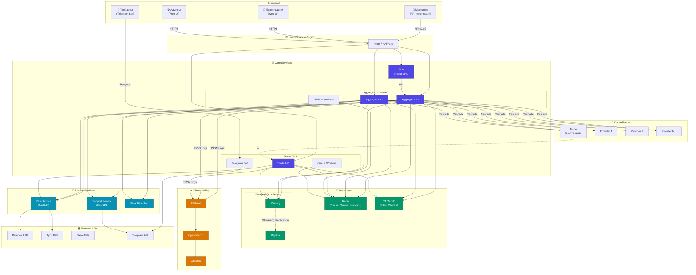
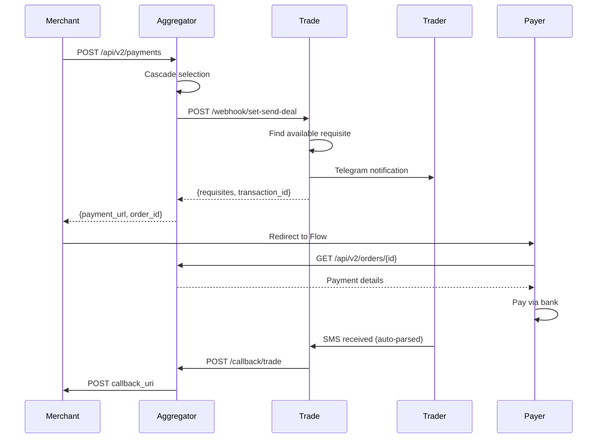
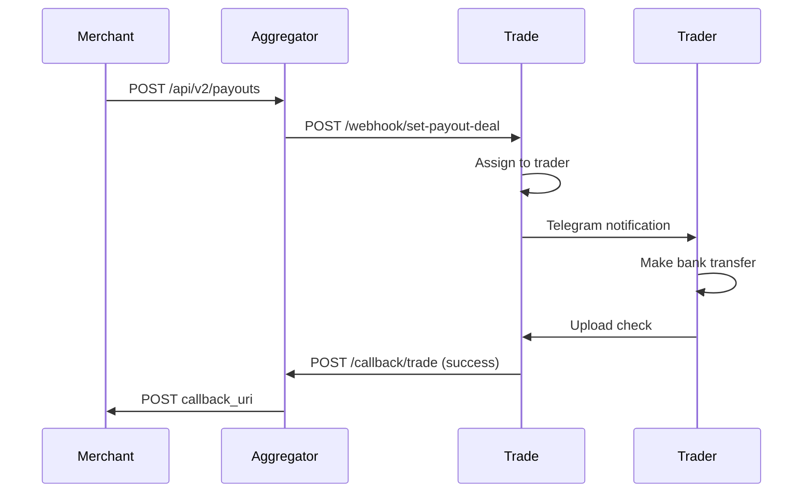
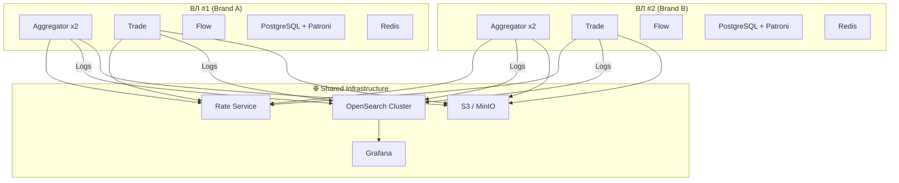
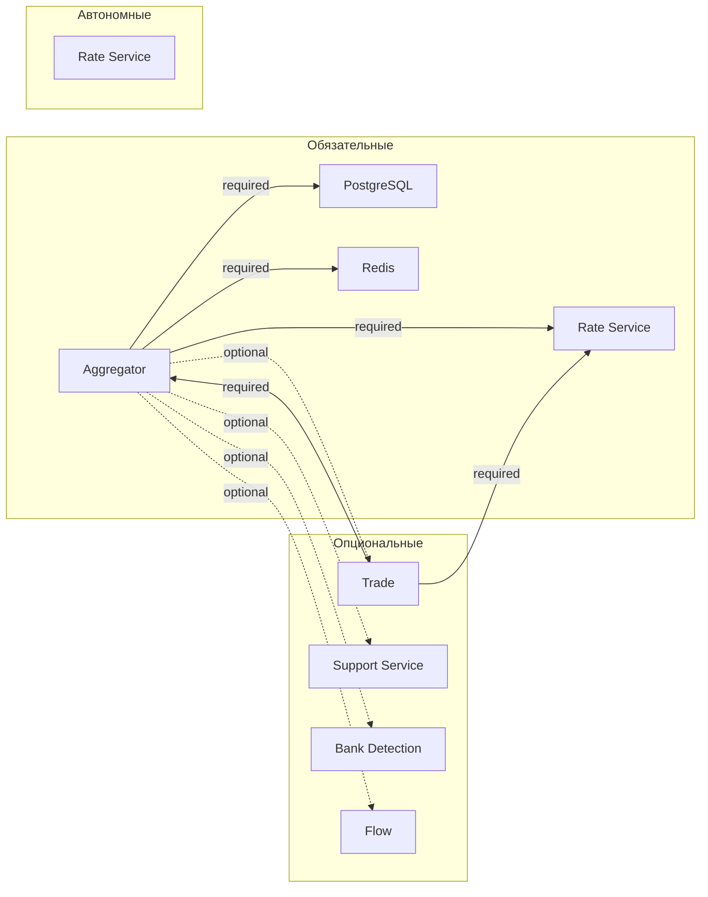

# PSP Platform Architecture

> **Связанная документация:**
>
> - [🔄 Trade Service](./ai/trade-service.md) — P2P процессинг
> - [📡 API Reference (Postman)](https://documenter.getpostman.com/view/13931884/2sAYQdipUu) — API документация
> - [📖 Glossary](./ai/glossary.md) — Глоссарий терминов

---

## 🏗️ Обзор сервисов


| Сервис                  | Стек                | Порт   | Описание                                                                         |
| ----------------------- | ------------------- | ------ | -------------------------------------------------------------------------------- |
| **Aggregator**          | Laravel 12/PHP 8.4  | 80/443 | Core API для мерчантов, cascade к провайдерам                                    |
| **Admin Panel**         | React 19/TypeScript | 80/443 | Новая админ-панель агрегатора (SPA, взаимодействует с Aggregator через REST API) |
| **Agradmin** *(legacy)* | Yii2/PHP            | 80/443 | Старая админ-панель (заменяется на Admin Panel)                                  |
| **Trade**               | Yii2/PHP            | 80/443 | P2P процессинг, управление трейдерами и реквизитами                              |
| **Flow**                | React/TypeScript    | 80/443 | Платёжный UI для плательщиков                                                    |
| **Merchant Panel**      | React 19/TypeScript | 80/443 | Кабинет мерчанта (SPA)                                                           |
| **Rate Service**        | FastAPI/Python      | 8080   | Курсы валют из бирж (Binance, Bybit, etc.)                                       |
| **Support Service**     | FastAPI/Python      | 8000   | Тикеты, диспуты, Telegram интеграция                                             |
| **Bank Detection**      | —                   | —      | Определение банка по номеру карты (BIN)                                          |


---

## 📊 Архитектурная диаграмма




---

## 📦 Детализация сервисов

### 1. Aggregator (Laravel)

**Назначение:** Центральный API для мерчантов, бэкенд админки, cascade к провайдерам.

```
aggregator/
├── app/
│   ├── Gateway/           # Провайдеры (полный список в docs/gateways.csv)
│   │   └── Universal/     # Gateway Builder (UniversalGateway, TemplateEngine, SignatureGenerator)
│   ├── Http/Controllers/
│   │   ├── Api/           # Merchant API v1/v2
│   │   └── Merchants/     # Merchant cabinet
│   ├── Jobs/              # Async tasks (callbacks, checks)
│   ├── Services/          # Business logic
│   └── Models/            # Eloquent models
├── routes/
│   ├── api.php            # /api/* routes
│   └── web.php            # Callbacks, admin
└── config/
    └── gateway.php        # Provider configurations
```

**API Endpoints:**


| Endpoint                   | Method | Описание                 |
| -------------------------- | ------ | ------------------------ |
| `/api/v2/payments`         | POST   | Создание payin           |
| `/api/v2/payouts`          | POST   | Создание payout          |
| `/api/v2/status`           | POST   | Статус платежа           |
| `/api/v2/balance`          | GET    | Баланс мерчанта          |
| `/api/callback/{provider}` | POST   | Callbacks от провайдеров |


**Зависимости:**

- PostgreSQL (основная БД)
- Redis (cache, queue, sessions)
- Rate Service (курсы)
- S3 (чеки, файлы)

---

### 2. Trade (Yii2)

**Назначение:** P2P процессинг — управление трейдерами, реквизитами, автоматическая обработка SMS/Push.

```
trade/
├── backend/
│   ├── controllers/
│   │   ├── WebhookController.php  # Merchant API
│   │   └── ApiController.php      # Trader API
│   ├── models/
│   │   ├── Order.php              # Заявки
│   │   ├── Requisite.php          # Реквизиты
│   │   └── Trader.php             # Трейдеры
│   └── services/
│       ├── SmsParser/             # Парсинг SMS по банкам
│       └── OrderDistributor.php   # Распределение заявок
├── frontend/                       # Trader UI (Yii2 Views)
└── console/
    └── controllers/               # Cron jobs
```

**API Endpoints (WebhookController):**


| Endpoint                    | Описание                        |
| --------------------------- | ------------------------------- |
| `/webhook/set-send-deal`    | Создание payin заявки           |
| `/webhook/set-payout-deal`  | Создание payout заявки          |
| `/webhook/get-status-deal`  | Статус заявки                   |
| `/webhook/set-sms-{bank}`   | SMS webhook от банков           |
| `/webhook/check-requisites` | Проверка доступности реквизитов |


**Trader API:**


| Endpoint         | Описание               |
| ---------------- | ---------------------- |
| `/api/orders`    | Список заявок трейдера |
| `/api/devices`   | Устройства трейдера    |
| `/api/device-qr` | QR для SMS Forwarder   |


**Особенности:**

- Не продаётся без Aggregator
- Нет мерчантов — работает только как провайдер
- Telegram Bot для трейдеров
- Автоматический парсинг SMS (Sber, Tinkoff, etc.)

---

### 3. Flow (React)

**Назначение:** Платёжный UI для плательщиков.

```
flow/
├── src/
│   ├── components/
│   │   ├── MainForm/          # Основная форма
│   │   ├── PaymentMethodSelector/  # Выбор метода
│   │   ├── Details/           # Реквизиты для оплаты
│   │   ├── ImageUploader/     # Загрузка чека
│   │   └── Timer/             # Таймер оплаты
│   ├── assets/brand/          # Брендинг (30+ брендов)
│   ├── services/api.ts        # API клиент
│   └── store/                 # Redux state
└── public/
```

**Роуты:**


| Route       | Описание                     |
| ----------- | ---------------------------- |
| `/:orderId` | Страница оплаты              |
| `/`         | Тестовое создание транзакции |


**Брендинг:** 30+ white-label брендов (logo-light.svg, logo-dark.svg, favicon.ico)

---

### 4. Frontend (React 19 Monorepo)

**Назначение:** Новая админ-панель и кабинет мерчанта. Монорепозиторий с shared пакетами.

**Репозиторий:** `highpay/frontend`

```
frontend/
├── admin-panel/           # Админ-панель агрегатора (SPA)
│   └── src/
│       ├── pages/         # ~29 страниц (Dashboard, Merchants, Methods, Gateway Builder, etc.)
│       ├── components/
│       │   ├── merchants/        # Табы карточки мерчанта (General, Methods, Balance, etc.)
│       │   ├── gateway-builder/  # AI Chat, API Tester, Monaco Editor, Import, Presets
│       │   ├── roles/            # Матрица прав (RBAC)
│       │   └── ui/               # UI-компоненты
│       ├── clients/       # White-label конфиги (aggrepay, asgard, default)
│       └── i18n/          # ru, en, ko
├── merchant-panel/        # Кабинет мерчанта (SPA)
│   └── src/
│       ├── pages/         # Payments, Balance, Reports, Settings, etc.
│       ├── components/
│       │   └── modals/    # Payin, Payout, Withdrawal, Convert, Insurance
│       └── stores/        # Zustand (auth)
├── packages/
│   ├── lib/               # Shared: API client, types, utils, hooks
│   └── ui/                # Shared UI: badge, button, input, modal, sidebar, etc.
└── package.json           # npm workspaces
```

**Стек:** React 19, TypeScript 5.9, TanStack Query + Table, Zustand, Tailwind CSS 4, Vite 6

**Статус:** В разработке. Заменяет agradmin (Yii2) и старый merchant cabinet.

**API:** Использует REST API Aggregator (Sanctum auth, RBAC permissions).

---

### 5. Rate Service (FastAPI)

**Назначение:** Агрегация курсов с бирж для всех сервисов.

```
rate/
├── main.py              # FastAPI app
├── exchanges.py         # Binance, Bybit, HTX adapters
├── tasks.py             # Background polling
├── config.py            # Methods configuration
└── authentication.py    # Basic auth
```

**API:**


| Endpoint               | Описание                |
| ---------------------- | ----------------------- |
| `GET /rate`            | Получить курс           |
| `PATCH /rate`          | Установить курс вручную |
| `GET /methods`         | Список методов          |
| `POST /update_methods` | Обновить конфигурацию   |


**Поддерживаемые валюты:**
RUB, UZS, KZT, KGS, AZN, TJS, TRY, GEL, INR, ARS, EUR

**Биржи:** Binance, Bybit, HTX, Grinex, Rapira

---

### 6. Support Service (FastAPI)

**Назначение:** Система тикетов и диспутов с Telegram интеграцией.

```
support-service/
├── app/
│   ├── routers/
│   │   ├── webhook.py      # Incoming webhooks
│   │   ├── orders.py       # Order actions
│   │   ├── messages.py     # Message history
│   │   └── disputes.py     # Dispute management
│   ├── services/
│   │   ├── telegram.py     # Telegram client
│   │   └── alerts.py       # Alert notifications
│   └── models.py           # SQLAlchemy models
└── main.py
```

**API:**


| Endpoint                      | Описание               |
| ----------------------------- | ---------------------- |
| `/webhook/action`             | Действия из Aggregator |
| `/orders/{order_id}/messages` | История сообщений      |
| `/disputes`                   | Управление диспутами   |


---

---

## 🔄 Потоки данных

### Payin Flow (Aggregator → Trade)




### Payout Flow (Aggregator → Trade)




---

## 🏢 Multi-tenant Architecture




**Изолировано для каждого ВЛ:**

- Aggregator (2 реплики)
- Trade
- Flow (с брендингом)
- PostgreSQL + Patroni
- Redis

**Shared между всеми ВЛ:**

- Rate Service (один инстанс)
- OpenSearch (разные индексы по ВЛ)
- Grafana
- S3/MinIO

---

## 📋 Зависимости между сервисами




| Сервис              | Может работать без                   |
| ------------------- | ------------------------------------ |
| **Aggregator**      | Trade, Support, Bank Detection, Flow |
| **Trade**           | — (требует Aggregator)               |
| **Rate Service**    | Всё (полностью автономный)           |
| **Support Service** | — (требует Aggregator)               |
| **Flow**            | — (требует Aggregator API)           |


---

## 🔧 Технологический стек


| Компонент                                        | Технология                           | Версия        |
| ------------------------------------------------ | ------------------------------------ | ------------- |
| **Aggregator**                                   | Laravel                              | 12 (PHP 8.4)  |
| **Trade**                                        | Yii2                                 | 2.0 (PHP 8.x) |
| **Flow**                                         | React + TypeScript + Vite            | 18+           |
| **Admin Panel**                                  | React 19 + TanStack + Zustand + Vite | —             |
| **Merchant Panel**                               | React 19 + TanStack + Zustand + Vite | —             |
| **Rate Service**                                 | FastAPI + Redis                      | 0.100+        |
| **Support Service**                              | FastAPI + SQLAlchemy                 | 0.100+        |
| **Agradmin** (legacy, заменяется на Admin Panel) | Yii2                                 | 2.0           |
| **Database**                                     | PostgreSQL + Patroni                 | 15+           |
| **Cache/Queue**                                  | Redis                                | 7+            |
| **Search/Logs**                                  | OpenSearch                           | 2.x           |
| **Metrics**                                      | Prometheus + Grafana                 | —             |
| **Log Shipping**                                 | Filebeat                             | 8.x           |
| **Storage**                                      | S3 / MinIO                           | —             |
| **Container**                                    | Docker                               | —             |


---

## 📡 Порты и эндпоинты


| Сервис          | Порт   | Health Check         |
| --------------- | ------ | -------------------- |
| Aggregator      | 80/443 | `/api/health`        |
| Trade           | 80/443 | `/site/health`       |
| Flow            | 80/443 | Static SPA           |
| Rate Service    | 8080   | `/health`            |
| Support Service | 8000   | `/docs` (Swagger UI) |
| PostgreSQL      | 5432   | —                    |
| Redis           | 6379   | —                    |
| OpenSearch      | 9200   | `/_cluster/health`   |
| Grafana         | 3000   | `/api/health`        |


---

## 🔐 Безопасность


| Уровень           | Механизм                            |
| ----------------- | ----------------------------------- |
| **API Auth**      | Bearer Token (Sanctum)              |
| **Signature**     | HMAC-SHA256 для платежей            |
| **IP Whitelist**  | Для merchant API                    |
| **2FA**           | Google Authenticator (Trade, Admin) |
| **Internal Auth** | Basic Auth (Rate, Support)          |
| **Secrets**       | Encrypted в .env                    |


