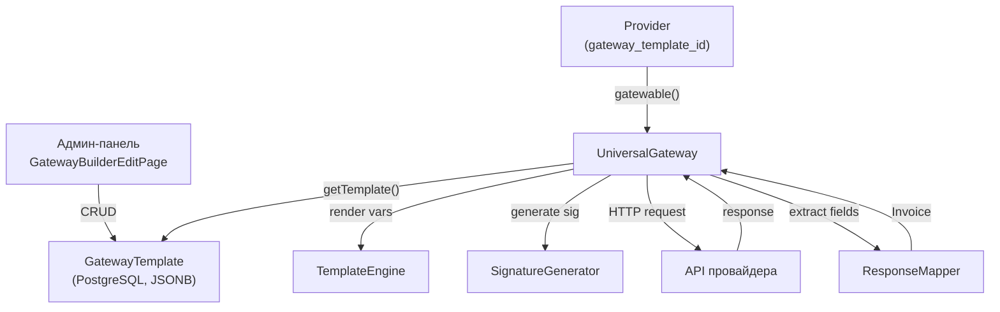

# Gateway Builder — конструктор шлюзов

> Система создания платёжных шлюзов через JSON-конфигурацию, без написания PHP-кода.

---

## Обзор

Gateway Builder позволяет владельцам WL создавать и настраивать интеграции с платёжными провайдерами из админ-панели. Вместо PHP-класса (как для существующих шлюзов), конфигурация описывается в JSON-шаблоне (`GatewayTemplate`), который интерпретируется в рантайме классом `UniversalGateway`.

Основные возможности:

- Создание payin и payout интеграций без деплоя кода
- Подстановка переменных `{{variable}}` с поддержкой модификаторов типов
- 13 алгоритмов подписи (HMAC, SHA, RSA, JWT, MD5, Base64)
- Multi-step запросы (OAuth2, токен + создание)
- Встроенный API-тестер (Postman-like)
- AI-ассистент (Claude / GPT) для генерации конфигов из документации провайдера
- Импорт/экспорт шаблонов (JSON)
- 6 стартовых пресетов
- Цепочки реквизитов (requisite chain)

---

## Архитектура

### Файловая структура

```
# Бэкенд (aggregator/)
app/Gateway/Universal/
├── UniversalGateway.php      — основная реализация Gatewable + processPayout
├── TemplateEngine.php        — подстановка {{переменных}} с модификаторами типов
├── SignatureGenerator.php    — генерация подписей (hmac, sha, rsa, jwt, md5)
└── ResponseMapper.php        — извлечение данных из ответа (dot notation)

app/Http/Controllers/Api/Admin/
├── GatewayTemplateController.php   — CRUD + import/export шаблонов
├── GatewayTesterController.php     — API-тестер (create_invoice, create_payout, get_status, callback)
├── AiAssistantController.php       — AI-чат (streaming SSE, инструменты)
└── AiAgentController.php           — AI Agent (tool use, автономные действия)

app/Services/AiAgent/
├── AgentOrchestrator.php     — оркестратор LLM + tools
├── ToolRegistry.php          — реестр инструментов
├── DynamicContextService.php — динамический контекст из JSON-датасетов
├── ContextBuilder.php        — сборщик контекста для промптов
└── Tools/
    ├── TestCreateInvoiceTool.php    — тест create_invoice
    ├── TestCreatePayoutTool.php     — тест create_payout
    ├── TestGetStatusTool.php        — тест get_status
    ├── TestCallbackTool.php         — тест callback
    ├── TestSignatureTool.php        — тест подписи
    ├── ValidateConfigTool.php       — валидация конфига
    ├── SaveConfigTool.php           — сохранение шаблона
    ├── DryRunTool.php               — dry-run запроса
    ├── GetTemplateTool.php          — получение текущего шаблона
    └── GetExamplesTool.php          — примеры из базы паттернов

app/Models/GatewayTemplate.php      — модель (fillable: name, slug, config sections)
app/Providers/AiAgentServiceProvider.php — регистрация AI tools

# Фронтенд (front/admin-panel/)
src/pages/
├── GatewayBuilderPage.tsx           — список шаблонов (пагинация, поиск, импорт)
└── GatewayBuilderEditPage.tsx       — редактор шаблона (10 табов)

src/components/gateway-builder/
├── AiChat.tsx            — AI-чат (streaming, подтверждение конфигов)
├── ApiTester.tsx          — Postman-like тестер (4 действия: invoice, payout, status, callback)
├── JsonEditor.tsx         — Monaco Editor с подсветкой {{переменных}}
├── MiniJsonEditor.tsx     — компактный Monaco для тестера
├── ImportTemplateModal.tsx — импорт JSON с drag-and-drop
├── ToolCallCard.tsx       — отображение tool calls AI
└── presets.ts             — 6 стартовых пресетов

# Данные
aggregator/storage/app/gateway-builder/
├── dynamic-context.json      — проанализированные паттерны шлюзов
└── import-templates.json     — готовые импортируемые шаблоны
```

### Взаимодействие компонентов



---

## JSON-шаблон: структура

Шаблон `GatewayTemplate` хранится в PostgreSQL. Каждая секция — отдельная JSONB-колонка.

```json
{
  "name": "My Gateway",
  "slug": "my-gateway",
  "credential_schema": { ... },
  "method_params_schema": { ... },
  "create_invoice": { ... },
  "create_payout": { ... },
  "handle_callback": { ... },
  "get_status": { ... },
  "set_status": { ... },
  "get_balance": { ... },
  "requisite_chain": { ... },
  "authentication": { ... }
}
```

---

## Секции шаблона

### credential_schema — поля провайдера

Определяет поля для формы создания/редактирования Provider. Каждый ключ автоматически доступен как `{{переменная}}`.

```json
{
  "baseUrl": { "type": "url", "required": true, "label": "API Base URL" },
  "apiKey": { "type": "hash", "required": true, "label": "API Key" },
  "merchantId": { "type": "string", "required": true, "label": "Merchant ID" },
  "mode": {
    "type": "select",
    "required": false,
    "label": "Режим",
    "options": { "live": "Production", "test": "Sandbox" }
  }
}
```

Типы полей:

| Тип | Описание | Хранение |
|-----|----------|----------|
| `hash` | Секретные данные (ключи, токены, пароли) | Шифруется (`Crypt::encryptString`) |
| `url` | URL с валидацией http/https | Открытое |
| `string` | Текстовое поле | Открытое |
| `integer` | Числовое поле | Открытое |
| `select` | Выпадающий список, требует `options` | Открытое |

Правило: API-ключи, секреты, приватные ключи → всегда `hash`. URL → `url`. Идентификаторы → `string`.

### method_params_schema — поля метода

Аналогичная структура. Переменные доступны как `{{methodParam.X}}`.

```json
{
  "paymentMethod": {
    "type": "select",
    "required": true,
    "label": "Payment Type",
    "options": { "sbp": "SBP", "c2c": "Card-to-Card", "ecom": "E-commerce" }
  }
}
```

### create_invoice — создание платежа (payin)

#### Одношаговый запрос

```json
{
  "method": "POST",
  "url": "{{baseUrl}}/api/v1/payments",
  "content_type": "json",
  "headers": {
    "Authorization": "Bearer {{apiKey}}",
    "Content-Type": "application/json"
  },
  "body": {
    "amount": "{{amount}}",
    "order_id": "{{orderId}}",
    "currency": "{{currency}}",
    "callback_url": "{{callbackUrl}}"
  },
  "signature": { ... },
  "response_mapping": {
    "transaction_id": ["data.payment_id", "data.id"],
    "payment_url": "data.checkout_url",
    "address": "data.requisites.card",
    "recipient": "data.requisites.holder"
  },
  "strip_empty": true,
  "body_encoding": "none",
  "response_format": "json"
}
```

Параметры:

| Поле | Описание | Значения |
|------|----------|----------|
| `method` | HTTP-метод | `GET`, `POST`, `PUT`, `PATCH` |
| `content_type` | Формат тела | `json` (70%), `form` (urlencoded), `query`, `multipart` |
| `strip_empty` | Удалять пустые поля | `true` (по умолчанию) — убирает ключи где `{{var}}` = "" |
| `body_encoding` | Кодирование тела | `none`, `base64`, `serialize_base64` |
| `response_format` | Формат ответа | `json`, `xml`, `text` |

#### Multi-step запрос (OAuth2, токен-потоки)

```json
{
  "steps": [
    {
      "name": "auth",
      "method": "POST",
      "url": "{{baseUrl}}/auth/token",
      "content_type": "form",
      "body": {
        "grant_type": "client_credentials",
        "client_id": "{{clientId}}",
        "client_secret": "{{clientSecret}}"
      },
      "response_mapping": {
        "access_token": "access_token"
      }
    },
    {
      "name": "create",
      "method": "POST",
      "url": "{{baseUrl}}/api/payments",
      "headers": {
        "Authorization": "Bearer {{step.auth.access_token}}"
      },
      "body": { ... },
      "response_mapping": {
        "transaction_id": "data.id",
        "payment_url": "data.url"
      }
    }
  ]
}
```

Ограничения: максимум 10 шагов, общий таймаут 60 секунд. Каждый шаг даёт переменные `{{step.NAME.field}}` для следующих шагов.

### create_payout — выплата

Опциональная секция. Структура аналогична `create_invoice`, но использует другой набор переменных — из модели `Invoice` (адрес получателя, реквизиты).

```json
{
  "method": "POST",
  "url": "{{baseUrl}}/api/v1/payouts",
  "headers": {
    "Authorization": "Bearer {{apiKey}}",
    "Content-Type": "application/json",
    "X-Signature": "{{signature}}"
  },
  "body": {
    "amount": "{{amount}}",
    "card_number": "{{address}}",
    "recipient_name": "{{recipient}}",
    "bank_code": "{{bank}}",
    "order_id": "{{orderId}}",
    "currency": "{{currency}}",
    "callback_url": "{{callbackUrl}}"
  },
  "signature": {
    "algorithm": "hmac-sha256",
    "key": "{{secretKey}}",
    "data_source": "body_json",
    "placement": "header",
    "header_name": "X-Signature"
  },
  "response_mapping": {
    "transaction_id": ["data.payout_id", "data.id"],
    "status": "data.status"
  }
}
```

Переменные доступные только в payout (из Invoice):

| Переменная | Описание |
|------------|----------|
| `{{address}}` | Номер карты / счёт / кошелёк получателя |
| `{{cardNumber}}` | Алиас для `{{address}}` |
| `{{recipient}}` | Имя получателя |
| `{{bank}}` | Код банка |
| `{{bankName}}` | Название банка |

Все остальные переменные (credentials, payment, auto-generated, methodParam) также доступны.

Multi-step payouts поддерживаются — формат `"steps": [...]` аналогичен create_invoice.

Response mapping для payout: `transaction_id`, `status` (→ состояние invoice), `rate`, `message`.

### handle_callback — обработка webhook

```json
{
  "signature_verification": {
    "algorithm": "hmac-sha256",
    "key": "{{secretKey}}",
    "data_template": "{{transaction_id}}:{{amount}}:{{status}}",
    "source": "header",
    "header_name": "X-Signature"
  },
  "field_mapping": {
    "transaction_id": "data.payment.id",
    "status": "data.payment.status",
    "amount": "data.payment.amount",
    "order_id": "data.order_id"
  },
  "status_mapping": {
    "success": "finished",
    "completed": "finished",
    "pending": "pending",
    "processing": "pending",
    "failed": "canceled",
    "declined": "canceled",
    "expired": "expired"
  },
  "replay_protection": {
    "timestamp_field": "ts",
    "max_age_seconds": 300,
    "idempotency_field": "request_id"
  },
  "response_format": "{\"code\": 0, \"message\": \"success\"}"
}
```

Важно:

- `field_mapping` поддерживает dot notation: `"data.payment.id"` и fallback-массивы: `["data.id", "payment_id"]`
- `status_mapping` — регистронезависимый, поддерживает числовые статусы: `{"1": "finished", "0": "canceled"}`
- Внутренние статусы: `finished`, `pending`, `canceled`, `expired`, `dispute`, `in_check`, `failed`
- Немапленный статус → `failed` по умолчанию
- `signature_verification.source`: `header` / `body` / `query` — откуда берётся подпись
- Для RSA: добавляется `verify_key: "{{publicKey}}"` (публичный ключ, отдельно от приватного `key`)
- `response_format`: что вернуть провайдеру (`"OK"`, `{"code": 0}`, шаблон с `{{transactionId}}`)

### get_status — проверка статуса

Структура аналогична `create_invoice`. Доступна переменная `{{transactionId}}`. Требуется `response_mapping` с `status` + `status_mapping`.

### get_balance — запрос баланса

Аналогично. `response_mapping` должен содержать `balance` и `currency`.

### set_status — изменение статуса

Одноэндпоинтный формат или `"actions"` по статусам. Доступны: `{{transactionId}}`, `{{status}}`, `{{amount}}`, `{{fileBase64}}`, `{{fileName}}`.

### authentication — OAuth2/токен-авторизация

```json
{
  "type": "oauth2",
  "url": "{{baseUrl}}/auth/token",
  "method": "POST",
  "content_type": "form",
  "body": {
    "grant_type": "client_credentials",
    "client_id": "{{clientId}}",
    "client_secret": "{{clientSecret}}"
  },
  "token_path": "data.access_token",
  "token_variable": "authToken",
  "cache_ttl": 3600
}
```

Выполняется перед `create_invoice`. Токен кэшируется в Redis на `cache_ttl` секунд. Использовать как `{{authToken}}` (или кастомное имя из `token_variable`).

Альтернатива multi-step в `create_invoice` — проще и с автокэшированием.

### requisite_chain — цепочка реквизитов

Позволяет одному шлюзу получать реквизиты от другого провайдера и использовать их.

```json
{
  "source": {
    "provider_id": 42,
    "extract_mapping": {
      "card_number": "address",
      "bank": "bank",
      "recipient": "recipient"
    }
  },
  "inject_as": {
    "card_number": "{{chain.card_number}}",
    "bank": "{{chain.bank}}",
    "recipient": "{{chain.recipient}}"
  }
}
```

---

## Система подписей (SignatureGenerator)

### Поддерживаемые алгоритмы

| Алгоритм | Описание | Требует `key` |
|----------|----------|---------------|
| `hmac-sha256` | HMAC-SHA256 | Да (secretKey) |
| `hmac-sha512` | HMAC-SHA512 | Да |
| `hmac-md5` | HMAC-MD5 | Да |
| `sha256` | Простой SHA256-хеш | Нет |
| `sha512` | Простой SHA512-хеш | Нет |
| `md5` | Простой MD5-хеш | Нет |
| `rsa-sha256` | RSA подпись SHA256 | Да (PEM private key) |
| `rsa-sha512` | RSA подпись SHA512 | Да (PEM private key) |
| `base64` | Base64-кодирование | Нет |
| `jwt-hs256` | JWT с HMAC-SHA256 | Да |
| `jwt-rs256` | JWT с RSA-SHA256 | Да (PEM private key) |
| `none` | Без подписи | Нет |

### Источники данных для подписи

| Источник | Описание |
|----------|----------|
| `data_template` | Ручная конкатенация: `"{{field1}}:{{field2}}:{{key}}"` — самый частый |
| `body_json` | `json_encode(body)` — подпись всего тела |
| `body_sorted` | Значения body отсортированные по ключам |
| `body_sorted_with_keys` | `key1=val1&key2=val2` отсортированный |

### Параметры подписи

```json
{
  "algorithm": "hmac-sha256",
  "key": "{{secretKey}}",
  "data_template": "{{merchantId}}:{{amount}}:{{orderId}}",
  "data_source": null,
  "placement": "header",
  "header_name": "X-Signature",
  "output_format": "hex",
  "json_flags": null
}
```

- `placement`: `header` (+ `header_name`), `body` (+ `field_name`), `query` (+ `field_name`)
- `json_flags` (для `body_json`): `null` (стандартный json_encode), `"unescaped"`, `"unescaped_unicode"`, `"unescaped_slashes"`
- Для JWT: `"claims_template": {"sub": "{{merchantId}}"}`, `"expiration": 300`

Критично: порядок полей в `data_template` и разделитель должны точно совпадать с документацией провайдера.

---

## Система переменных (TemplateEngine)

### Группы переменных

| Группа | Переменные | Контекст |
|--------|------------|----------|
| Credentials | Все ключи из `credential_schema` | create_invoice, create_payout, все секции |
| Payment | `{{amount}}`, `{{orderId}}`, `{{currency}}`, `{{description}}`, `{{callbackUrl}}`, `{{successUrl}}`, `{{failUrl}}` | create_invoice |
| Payer | `{{userIp}}`, `{{userId}}`, `{{customerName}}`, `{{customerEmail}}`, `{{customerPhone}}` | create_invoice |
| Transaction | `{{transactionId}}` | get_status, set_status |
| Auto-generated | `{{timestamp}}` (sec), `{{timestampMs}}` (ms), `{{nonce}}` (random 32), `{{uuid}}` | Все секции |
| Request | `{{httpMethod}}`, `{{endpoint}}`, `{{fullUrl}}` | Все секции |
| Method params | `{{methodParam.X}}` | Все секции |
| Multi-step | `{{step.NAME.field}}` | Внутри multi-step |
| Chain | `{{chain.card_number}}`, `{{chain.bank}}`, `{{chain.recipient}}`, `{{chain.rate}}`, `{{chain.transaction_id}}`, `{{chain.url}}` | requisite_chain |
| Auth | `{{authToken}}` (или кастомный `token_variable`) | После authentication |
| Payout (Invoice) | `{{address}}`, `{{cardNumber}}`, `{{recipient}}`, `{{bank}}`, `{{bankName}}` | Только create_payout |

### Модификаторы типов

Синтаксис: `{{переменная|модификатор}}` или `{{переменная|модификатор:параметр}}`

| Модификатор | Описание | Пример |
|-------------|----------|--------|
| `float` | Число с плавающей точкой | `{{amount\|float}}` → `1000.50` |
| `int` | Целое число | `{{amount\|int}}` → `1000` |
| `cents` | Умножить на 100 (копейки/центы) | `{{amount\|cents}}` → `100050` |
| `multiply:N` | Умножить на N | `{{amount\|multiply:1000}}` |
| `format:N` | number_format с N знаков | `{{amount\|format:2}}` → `"1000.50"` |
| `upper` | В верхний регистр | `{{currency\|upper}}` → `"RUB"` |
| `lower` | В нижний регистр | `{{currency\|lower}}` → `"rub"` |
| `md5` | MD5-хеш | `{{orderId\|md5}}` |
| `sha256` | SHA256-хеш | `{{data\|sha256}}` |
| `base64` | Base64-кодирование | `{{data\|base64}}` |
| `urlencode` | URL-кодирование | `{{param\|urlencode}}` |
| `json` | JSON-кодирование | `{{data\|json}}` |
| `substr:N` | Первые N символов | `{{card\|substr:6}}` → BIN |
| `trim` | Убрать пробелы | `{{name\|trim}}` |
| `replace:old,new` | Замена подстроки | `{{url\|replace:http,https}}` |

### Response Mapping

Извлечение данных из ответа провайдера:

| Синтаксис | Описание | Пример |
|-----------|----------|--------|
| Dot notation | Вложенные поля | `"data.payment.id"` |
| Array index | Доступ к элементу массива | `"deals.0.requisites"` |
| Fallback array | Первый non-null | `["data.id", "result.id", "id"]` |
| Conditional | По условию | `{"conditional": [{"when": {"methodParam.type": "sbp"}, "map": {"url": "data.sbp_link"}}]}` |

Поля для `create_invoice`: `transaction_id` (обязательно), `address`, `recipient`, `bank`, `bank_name`, `payment_url` / `url`, `rate`, `state`.

Поля для `create_payout`: `transaction_id`, `status` / `state`, `rate`, `message`.

---

## API-тестер (GatewayTesterController)

Встроенный Postman-like тестер в редакторе шаблона.

### Endpoint

`POST /api/v2/admin/gateway-tester/template-test`

### Параметры

| Поле | Тип | Описание |
|------|-----|----------|
| `action` | string | `create_invoice`, `create_payout`, `get_status`, `handle_callback` |
| `template_id` | int? | ID шаблона из БД |
| `template_config` | object? | Inline-конфиг (для тестирования несохранённых изменений) |
| `credentials` | object | Значения credential_schema |
| `method_params` | object? | Значения method_params_schema |
| `amount` | number? | Сумма (default: 1000) |
| `currency` | string? | Валюта (default: RUB) |
| `transaction_id` | string? | Для get_status |
| `address` | string? | Для create_payout (номер карты) |
| `recipient` | string? | Для create_payout (имя получателя) |
| `bank` | string? | Для create_payout (код банка) |
| `webhook_body` | object? | Для handle_callback |

### Ответ (create_invoice / create_payout)

```json
{
  "success": true,
  "action": "create_invoice",
  "duration_ms": 342,
  "request": {
    "method": "POST",
    "url": "https://api.provider.com/v1/payments",
    "headers": { ... },
    "body": { ... },
    "content_type": "json"
  },
  "signature": {
    "algorithm": "hmac-sha256",
    "signature": "a1b2c3...",
    "placement": "header",
    "data_signed": "merchant123:1000:order-abc"
  },
  "response": {
    "status": 200,
    "body": { ... }
  },
  "mapped": {
    "transaction_id": "pay_12345",
    "payment_url": "https://..."
  }
}
```

---

## AI-ассистент

### Настройка

Settings → AI Assistant в админ-панели:

| Настройка | Описание |
|-----------|----------|
| `ai.provider` | `anthropic` / `openai` / `disabled` |
| `ai.api_key` | API-ключ провайдера |
| `ai.model` | `claude-sonnet-4`, `claude-opus-4`, `gpt-4o`, `gpt-4o-mini` |

### Возможности

- Streaming SSE ответы
- Загрузка файлов (до 5MB) — документация провайдера
- Извлечение контента по URL (SSRF-protected)
- Генерация полных конфигов из описания API
- Анализ ошибок (401, signature mismatch, parsing errors)
- Tool use: тестирование invoice/payout, проверка подписи, сохранение конфига, dry-run
- Подтверждение конфигов: AI предлагает изменение → пользователь Apply/Discard
- История чата на шаблон (автосохранение, debounce 3 секунды)

### AI Tools

| Tool | Описание |
|------|----------|
| `test_create_invoice` | Выполнить реальный HTTP-запрос create_invoice |
| `test_create_payout` | Выполнить реальный HTTP-запрос create_payout |
| `test_get_status` | Проверить статус транзакции |
| `test_callback` | Симулировать webhook |
| `test_signature` | Вычислить подпись и сравнить |
| `validate_config` | Проверить JSON-конфиг на ошибки |
| `save_config` | Сохранить шаблон в БД |
| `dry_run` | Отрендерить запрос без отправки |
| `get_template` | Получить текущий шаблон |
| `get_examples` | Получить примеры из базы (196 паттернов) |

### Динамический контекст

Файл `storage/app/gateway-builder/dynamic-context.json` содержит:

- Проанализированные паттерны из реальных PHP-шлюзов
- Паттерны подписей с примерами алгоритмов
- Чек-листы отладки (signature errors, connection errors, mapping errors)
- Паттерны response mapping и status mapping

AI автоматически подбирает релевантные примеры по тегам (hmac, md5, oauth2, payout, form-encoded, и т.д.).

---

## Фронтенд: редактор шаблона

### Табы редактора (GatewayBuilderEditPage)

| Таб | Секция конфига | Описание |
|-----|---------------|----------|
| General | name, slug | Название, идентификатор, выбор пресета |
| Credentials | credential_schema | Поля провайдера |
| Create Invoice | create_invoice | Создание платежа |
| Payout | create_payout | Выплата (опционально) |
| Callback | handle_callback | Обработка webhook |
| Get Status | get_status | Проверка статуса |
| Set Status | set_status | Изменение статуса |
| Balance | get_balance | Запрос баланса |
| Method Params | method_params_schema | Поля метода |
| Req. Chain | requisite_chain | Цепочка реквизитов |
| Authentication | authentication | OAuth2/токен авторизация |

Каждый таб содержит Monaco Editor с подсветкой `{{переменных}}`, форматированием и валидацией JSON.

### Пресеты

6 стартовых шаблонов для быстрого начала:

| Пресет | Описание | Секции |
|--------|----------|--------|
| Simple REST | Bearer токен, JSON body | invoice, payout, callback, status |
| HMAC Signed | HMAC-SHA256 подпись | invoice, payout, callback, status |
| Form-Encoded | application/x-www-form-urlencoded | invoice, payout, callback, status |
| Multi-Step | OAuth2 двухшаговый | invoice, callback, status |
| H2H Card | Прямой карточный процессинг | invoice, callback, status, method_params |
| OAuth2 Auto-Auth | OAuth2 + RSA подпись + auto-cache | invoice, payout, callback, status, auth |

### Список шаблонов (GatewayBuilderPage)

- Пагинация (20 на страницу)
- Поиск по имени
- Кнопка импорта (JSON файл)
- Кнопка создания нового шаблона

---

## API: Gateway Templates

Префикс: `/api/v2/admin/gateway-templates`

| Метод | Endpoint | Описание |
|-------|----------|----------|
| GET | `/` | Список шаблонов (пагинация, search) |
| POST | `/` | Создание шаблона |
| GET | `/{id}` | Получение шаблона |
| PUT | `/{id}` | Обновление шаблона |
| DELETE | `/{id}` | Удаление шаблона |
| POST | `/import` | Импорт из JSON |
| GET | `/{id}/export` | Экспорт в JSON |

Все маршруты защищены `auth:admin` + RBAC permission.

---

## Как подключить шлюз через Builder

1. Создать GatewayTemplate в админ-панели (Gateway Builder → New Template)
2. Выбрать пресет или заполнить вручную
3. Заполнить credential_schema (какие поля ввода нужны при создании провайдера)
4. Настроить create_invoice (или загрузить доку в AI-чат)
5. Если нужны выплаты — настроить create_payout
6. Настроить handle_callback, get_status
7. Протестировать через API Tester (ввести реальные креды, нажать Create Invoice / Test Payout)
8. Создать Provider → выбрать шлюз `UniversalGateway` → указать `gateway_template_id`
9. Заполнить credential_schema поля (baseUrl, apiKey, ...)
10. Создать Method для Provider → заполнить method_params_schema если есть
11. Подключить метод к мерчанту

---

## Отладка типичных проблем

### HTTP 401 / 403 — аутентификация

- Проверить Authorization header (Bearer, Basic, кастомный)
- Проверить размещение API-ключа (header / body / query)
- Проверить IP whitelist у провайдера
- Для OAuth2: проверить cache_ttl, токен может быть просроченным
- RSA: проверить PEM-формат ключа (PKCS8)

### HTTP 400 "invalid signature"

- №1 причина: неправильный ПОРЯДОК полей в `data_template`
- №2: неправильный разделитель (`:` vs `""` vs `|` vs `&`)
- №3: неправильный алгоритм (md5 vs sha256 vs hmac-sha256)
- №4: `data_source` не совпадает (body_json vs body_sorted)
- №5: `json_flags` — стандартный json_encode vs unescaped
- №6: значения в подписи отличаются от отправленных

### HTTP 400 "amount format"

- Провайдер ждёт целые копейки → `{{amount|cents}}`
- Провайдер ждёт float → `{{amount|float}}`
- Провайдер ждёт строку → убедиться что `"{{amount}}"`

### Response mapping не работает

- Проверить dot notation путь в реальном ответе
- Использовать fallback-массивы: `["data.id", "result.id", "id"]`
- Для массивов: `"data.0.id"` — доступ по индексу

### Select не отображается в форме провайдера

- В credential_schema / method_params_schema использовать `"options": {"value": "Label"}`
- Или `"enum"` / `"values"` — все три варианта поддерживаются
- Backend преобразует в `Rule::in(...)` → Frontend рендерит `<select>`

---

**Последнее обновление:** 2026-03-24
